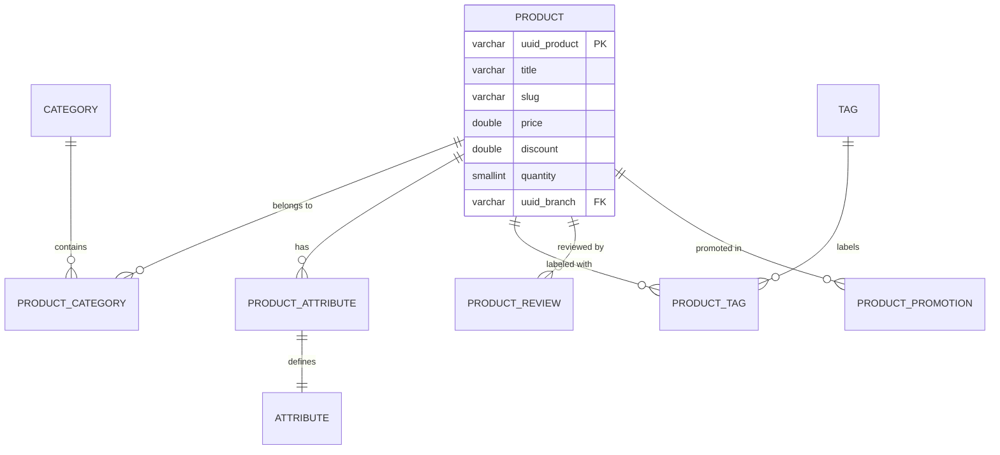

# Product Management

This module handles the core catalog functionality including products, categories, attributes, variations, and reviews.

## Entity Relationship Diagram



## Products

The `product` table is the central entity.

| Column | Type | Description |
|Args|---|---|
| `uuid_product` | varchar(40) | Primary Key. Defaults to `uuid_generate_v4()` |
| `title` | varchar(75) | Product name |
| `slug` | varchar(100) | URL friendly identifier |
| `price` | double | Base price |
| `discount` | double | Discount amount |
| `quantity` | smallint | Stock quantity |
| `shop` | smallint | Shop identifier |
| `uuid_branch` | varchar(40) | Branch identifier (Unique constraint `product_pk`?) |
| `type` | smallint | Product type (0: Simple, etc.) |

**SQL Definition:**
```sql
create table product
(
    uuid_product   varchar(40)      default "nest-store".uuid_generate_v4() not null
        primary key,
    title          varchar(75)                                              not null,
    meta_title     varchar(100),
    slug           varchar(100)                                             not null,
    summary        text,
    type           smallint         default 0                               not null,
    sku            varchar(100)                                             not null,
    price          double precision default 0                               not null,
    discount       double precision default 0                               not null,
    quantity       smallint         default 0                               not null,
    shop           smallint         default 0                               not null,
    created_date   timestamp        default CURRENT_TIMESTAMP               not null,
    updated_date   timestamp        default CURRENT_TIMESTAMP,
    published_date timestamp,
    start_date     timestamp,
    end_date       timestamp,
    description    text,
    uuid_branch    varchar(40)                                              not null
        constraint product_pk
            unique
);
```

> [!NOTE]
> The `uuid_branch` has a unique constraint `product_pk`, implying a one-to-one relationship or a unique mapping requirement per branch/product combination depending on intention, though primarily it looks like a foreign key to `branch`.

## Attributes & Tags

Products can have dynamic attributes and tags.

### Attributes
- **Table:** `attribute`, `product_attribute`
- **Logic:** `product_attribute` links a product to a specific value, and `attribute` defines the key metadata.

### Tags
- **Table:** `tag`, `product_tag`
- **Logic:** Many-to-many relationship.

## Categories
- **Table:** `category`, `product_category`
- **Logic:** Many-to-many relationship allows a product to be in multiple categories.
