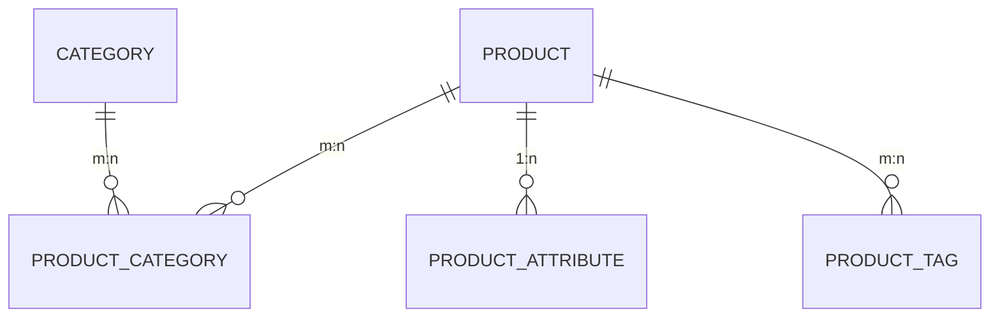

# Schema: Quản lý Sản phẩm

Module Sản phẩm là trung tâm của dữ liệu bán hàng, lưu trữ toàn bộ thông tin về danh mục, thuộc tính và tồn kho.

## 1. Sơ đồ Thực thể (ERD)

## 2. Chi tiết Định nghĩa Bảng

### Bảng `product`

Lưu trữ thông tin cơ bản và tồn kho của sản phẩm.

| Cột            | Kiểu dữ liệu | Ràng buộc        | Mô tả                      |
| :------------- | :----------- | :--------------- | :------------------------- |
| `uuid_product` | varchar(40)  | PK               | Khóa chính UUID v4         |
| `title`        | varchar(75)  | Not Null         | Tên sản phẩm               |
| `sku`          | varchar(100) | Not Null, Unique | Mã định danh kho           |
| `price`        | double       | Not Null         | Giá niêm yết               |
| `quantity`     | smallint     | Default 0        | Số lượng tồn kho           |
| `uuid_branch`  | varchar(40)  | FK               | Liên kết Chi nhánh quản lý |

### Bảng `attribute` & `product_attribute`

Hệ thống thuộc tính động cho phép thêm các thông số như Màu sắc, Kích cỡ mà không cần thay đổi cấu trúc bảng.

### Bảng `category`

Quản lý cây danh mục sản phẩm đa cấp.

---

> [!TIP]
> Sử dụng index trên cột `slug` và `sku` để tăng tốc độ truy vấn tìm kiếm sản phẩm.
