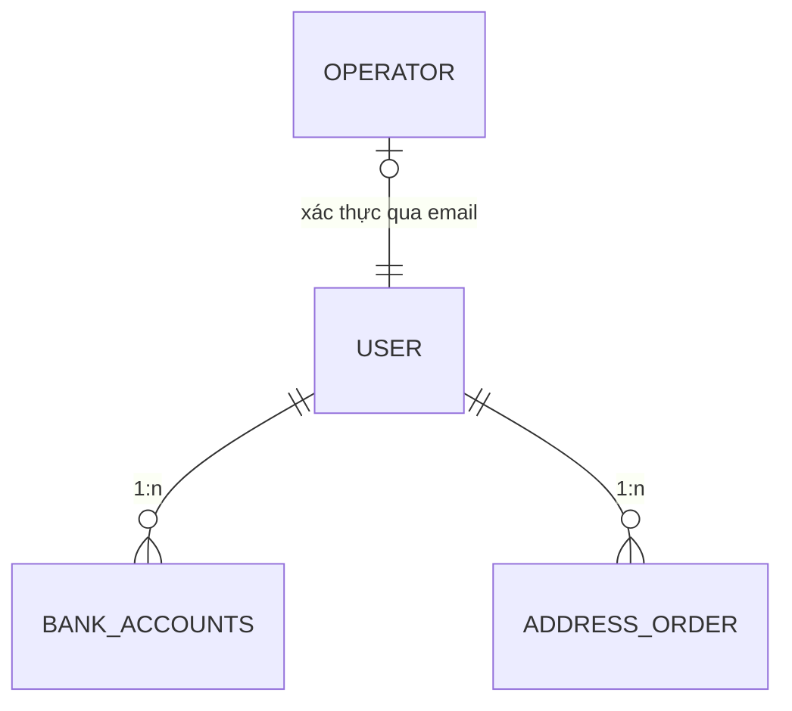

# Schema: Quản lý Người dùng

Module này lưu trữ toàn bộ thông tin định danh, hồ sơ cá nhân và phân quyền của các đối tượng tham gia vào hệ thống.

## 1. Sơ đồ Thực thể (ERD)

## 2. Chi tiết Định nghĩa Bảng

### Bảng `user`

Lưu trữ thông tin cốt lõi của khách hàng và nhà bán hàng.

| Cột         | Kiểu dữ liệu | Ràng buộc | Mô tả                      |
| :---------- | :----------- | :-------- | :------------------------- |
| `uuid_user` | varchar(40)  | PK        | Khóa chính UUID            |
| `email`     | varchar(50)  | Unique    | Email định danh            |
| `password`  | varchar(32)  | Not Null  | Hash mật khẩu (BCrypt)     |
| `admin`     | smallint     | Default 0 | Cờ quản trị viên (0/1)     |
| `vendor`    | smallint     | Default 0 | Cờ nhà bán lẻ (0/1)        |
| `activate`  | smallint     | Default 0 | Trạng thái kích hoạt (0/1) |

### Bảng `operator`

Danh sách nhân viên vận hành hệ thống được cấp quyền truy cập các module Admin.

| Cột             | Kiểu dữ liệu | Mô tả                   |
| :-------------- | :----------- | :---------------------- |
| `uuid_operator` | varchar(40)  | Khóa chính định danh    |
| `email`         | varchar(50)  | Email nhân viên công sở |

### Bảng `bank_accounts`

Thông tin tài chính phục vụ cho việc thanh toán hoa hồng cho Vendor hoặc hoàn tiền cho khách hàng.

### Bảng `address_order`

Lưu trữ sổ địa chỉ của người dùng để tăng tốc quá trình mua hàng lần sau.

---

> [!IMPORTANT]
> Toàn bộ thông tin nhạy cảm (như mật khẩu) phải được mã hóa một chiều trước khi lưu trữ vào Database.
