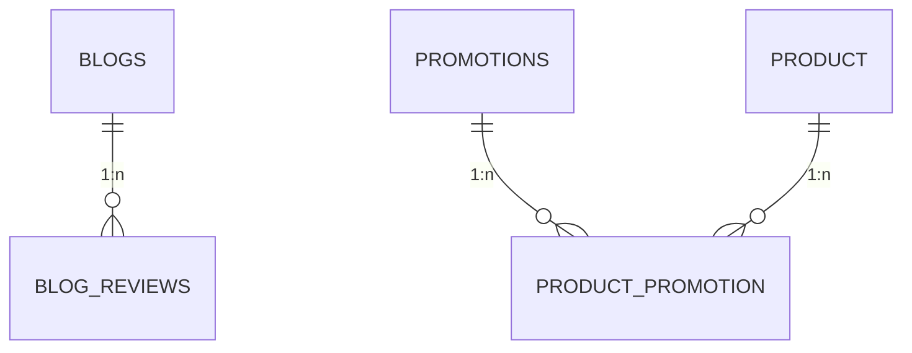

# Schema: Tiếp thị & Nội dung

Module này quản lý các nội dung số và các chiến dịch ưu đãi nhằm thu hút người dùng.

## 1. Sơ đồ Thực thể (ERD)

## 2. Chi tiết Định nghĩa Bảng

### Bảng `blogs`

Lưu trữ thông tin bài viết và blog.

| Cột         | Kiểu dữ liệu | Ràng buộc | Mô tả                  |
| :---------- | :----------- | :-------- | :--------------------- |
| `uuid_blog` | varchar(40)  | PK        | Khóa chính UUID        |
| `title`     | varchar(100) | Not Null  | Tiêu đề bài viết       |
| `tags`      | varchar(200) |           | Thẻ phân loại bài viết |

### Bảng `blog_reviews`

Lưu trữ đánh giá và bình luận của người dùng cho bài viết blog. Hỗ trợ quan hệ cha-con.

| Cột                       | Kiểu dữ liệu | Mô tả                             |
| :------------------------ | :----------- | :-------------------------------- |
| `uuid_blog_review`        | varchar(40)  | Khóa chính định danh              |
| `uuid_blog`               | varchar(40)  | FK tới bài viết gốc               |
| `uuid_parent_blog_review` | varchar(40)  | Liên kết bình luận cha (phản hồi) |
| `is_liked`                | boolean      | Trạng thái người dùng thích bài   |

### Bảng `promotions`

Quản lý mã giảm giá và chiến dịch khuyến mãi.

| Cột                | Kiểu dữ liệu | Ràng buộc | Mô tả                          |
| :----------------- | :----------- | :-------- | :----------------------------- |
| `uuid_promotion`   | varchar(40)  | PK        | Khóa chính UUID                |
| `code`             | varchar(255) | Unique    | Mã khuyến mãi (ví dụ: TET2025) |
| `discount`         | numeric(5,2) |           | Giá trị giảm giá               |
| `limit_amount_use` | integer      |           | Giới hạn lượt sử dụng          |

---

> [!TIP]
> Sử dụng bảng `product_promotion` để áp dụng khuyến mãi cho tập hợp các sản phẩm cụ thể thay vì toàn bộ hệ thống.
