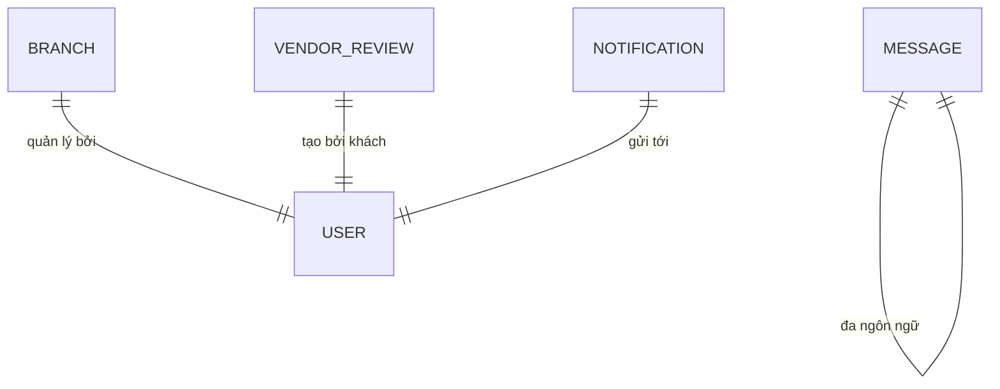

# Schema: Vận hành & Thông báo

Module này đảm bảo hệ thống vận hành trơn tru tại các địa điểm vật lý và duy trì kênh giao tiếp với người dùng.

## 1. Sơ đồ Thực thể (ERD)

## 2. Chi tiết Định nghĩa Bảng

### Bảng `branch`

Đại diện cho các kho hàng hoặc cửa hàng vật lý.

| Cột           | Kiểu dữ liệu | Ràng buộc | Mô tả             |
| :------------ | :----------- | :-------- | :---------------- |
| `uuid_branch` | varchar(40)  | PK        | Khóa chính        |
| `name`        | varchar(100) |           | Tên chi nhánh     |
| `uuid_user`   | varchar(40)  | FK        | Quản lý chi nhánh |

### Bảng `vendor_review`

Lưu trữ đánh giá hiệu suất phục vụ của từng chi nhánh/nhà bán hàng.

| Cột                  | Kiểu dữ liệu | Mô tả                          |
| :------------------- | :----------- | :----------------------------- |
| `uuid_vendor_review` | varchar(40)  | Khóa chính định danh           |
| `uuid_vendor`        | varchar(40)  | FK tới người dùng quản lý shop |
| `rating`             | smallint     | Điểm đánh giá dịch vụ          |

### Bảng `message` (I18n)

Lưu trữ các nhãn (labels) và thông báo hệ thống theo ngôn ngữ.

| Cột       | Kiểu dữ liệu | Ràng buộc | Mô tả              |
| :-------- | :----------- | :-------- | :----------------- |
| `key`     | varchar(255) | Unique    | Mã định danh chuỗi |
| `locale`  | varchar(10)  |           | Ngôn ngữ (vi, en)  |
| `content` | text         |           | Nội dung hiển thị  |

---

> [!NOTE]
> Bảng `message` cho phép hệ thống thay đổi ngôn ngữ giao diện (Frontend và thông báo) mà không cần deploy lại ứng dụng.
