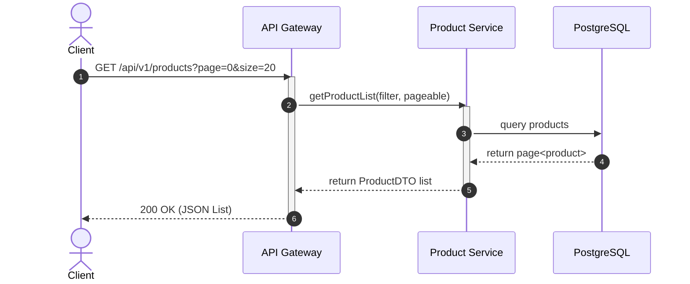
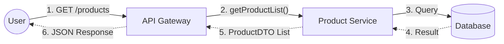
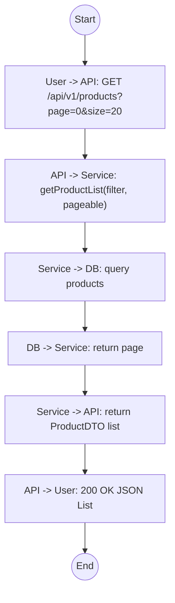

# Biểu đồ hệ thống UC01

## Sequence Diagram

```mermaid
sequenceDiagram
    autonumber
    actor User as Client
    participant API as API Gateway
    participant Service as Product Service
    participant DB as PostgreSQL

    User->>API: GET /api/v1/products?page=0&size=20
    activate API
    API->>Service: getProductList(filter, pageable)
    activate Service
    Service->>DB: query products
    DB-->>Service: return page<product>
    Service-->>API: return ProductDTO list
    deactivate Service
    API-->>User: 200 OK (JSON List)
    deactivate API
```

## Communication Diagram

```mermaid
graph LR
    User((User))
    API[API Gateway]
    Service[Product Service]
    DB[(Database)]

    User -- "1. GET /products" --> API
    API -- "2. getProductList()" --> Service
    Service -- "3. Query" --> DB
    DB -. "4. Result" .-> Service
    Service -. "5. ProductDTO List" .-> API
    API -. "6. JSON Response" .-> User
```

## Activity Diagram

```mermaid
graph TD
    Start((Start))
    Start --> Step1
    Step1["User -> API: GET /api/v1/products?page=0&size=20"]
    Step1 --> Step2
    Step2["API -> Service: getProductList(filter, pageable)"]
    Step2 --> Step3
    Step3["Service -> DB: query products"]
    Step3 --> Step4
    Step4["DB -> Service: return page<product>"]
    Step4 --> Step5
    Step5["Service -> API: return ProductDTO list"]
    Step5 --> Step6
    Step6["API -> User: 200 OK JSON List"]
    Step6 --> End((End))
```
