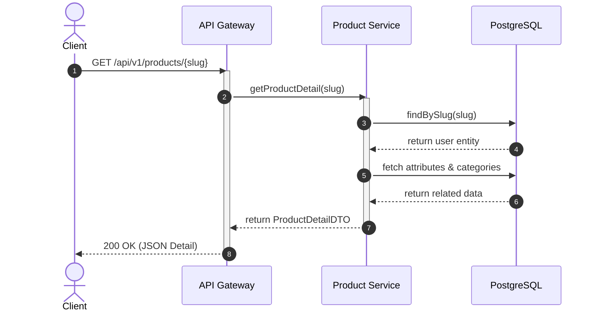
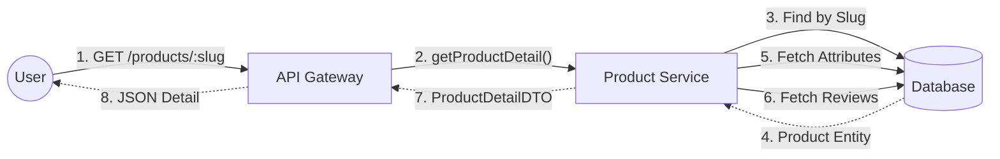
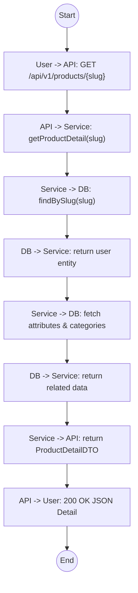

# Biểu đồ hệ thống UC02

## Sequence Diagram

```mermaid
sequenceDiagram
    autonumber
    actor User as Client
    participant API as API Gateway
    participant Service as Product Service
    participant DB as PostgreSQL

    User->>API: GET /api/v1/products/{slug}
    activate API
    API->>Service: getProductDetail(slug)
    activate Service
    Service->>DB: findBySlug(slug)
    DB-->>Service: return user entity
    Service->>DB: fetch attributes & categories
    DB-->>Service: return related data
    Service-->>API: return ProductDetailDTO
    deactivate Service
    API-->>User: 200 OK (JSON Detail)
    deactivate API
```

## Communication Diagram

```mermaid
graph LR
    User((User))
    API[API Gateway]
    Service[Product Service]
    DB[(Database)]

    User -- "1. GET /products/:slug" --> API
    API -- "2. getProductDetail()" --> Service
    Service -- "3. Find by Slug" --> DB
    DB -. "4. Product Entity" .-> Service
    Service -- "5. Fetch Attributes" --> DB
    Service -- "6. Fetch Reviews" --> DB
    Service -. "7. ProductDetailDTO" .-> API
    API -. "8. JSON Detail" .-> User
```

## Activity Diagram

```mermaid
graph TD
    Start((Start))
    Start --> Step1
    Step1["User -> API: GET /api/v1/products/{slug}"]
    Step1 --> Step2
    Step2["API -> Service: getProductDetail(slug)"]
    Step2 --> Step3
    Step3["Service -> DB: findBySlug(slug)"]
    Step3 --> Step4
    Step4["DB -> Service: return user entity"]
    Step4 --> Step5
    Step5["Service -> DB: fetch attributes & categories"]
    Step5 --> Step6
    Step6["DB -> Service: return related data"]
    Step6 --> Step7
    Step7["Service -> API: return ProductDetailDTO"]
    Step7 --> Step8
    Step8["API -> User: 200 OK JSON Detail"]
    Step8 --> End((End))
```
