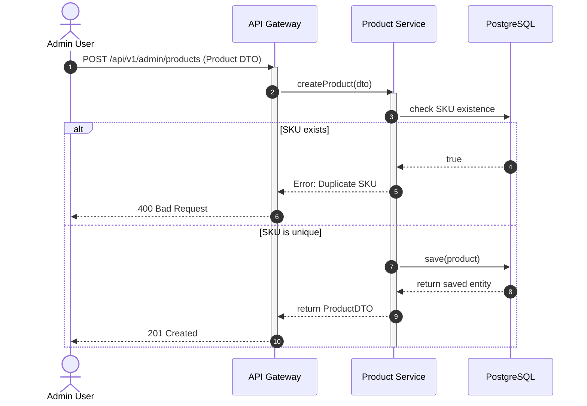
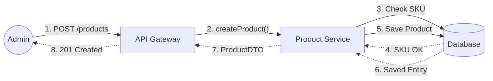
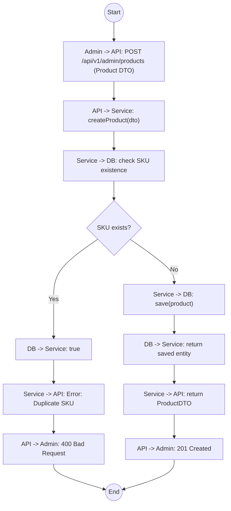

# Biểu đồ hệ thống UC10

## Sequence Diagram

```mermaid
sequenceDiagram
    autonumber
    actor Admin as Admin User
    participant API as API Gateway
    participant Service as Product Service
    participant DB as PostgreSQL

    Admin->>API: POST /api/v1/admin/products (Product DTO)
    activate API
    API->>Service: createProduct(dto)
    activate Service
    Service->>DB: check SKU existence
    alt SKU exists
        DB-->>Service: true
        Service-->>API: Error: Duplicate SKU
        API-->>Admin: 400 Bad Request
    else SKU is unique
        Service->>DB: save(product)
        DB-->>Service: return saved entity
        Service-->>API: return ProductDTO
        API-->>Admin: 201 Created
    end
    deactivate Service
    deactivate API
```

## Communication Diagram

```mermaid
graph LR
    Admin((Admin))
    API[API Gateway]
    Service[Product Service]
    DB[(Database)]

    Admin -- "1. POST /products" --> API
    API -- "2. createProduct()" --> Service
    Service -- "3. Check SKU" --> DB
    DB -. "4. SKU OK" .-> Service
    Service -- "5. Save Product" --> DB
    DB -. "6. Saved Entity" .-> Service
    Service -. "7. ProductDTO" .-> API
    API -. "8. 201 Created" .-> Admin
```

## Activity Diagram

```mermaid
graph TD
    Start((Start))
    Start --> Step1
    Step1["Admin -> API: POST /api/v1/admin/products (Product DTO)"]
    Step1 --> Step2
    Step2["API -> Service: createProduct(dto)"]
    Step2 --> Step3
    Step3["Service -> DB: check SKU existence"]
    Step3 --> Condition{SKU exists?}

    Condition -- Yes --> Step4
    Step4["DB -> Service: true"]
    Step4 --> Step5
    Step5["Service -> API: Error: Duplicate SKU"]
    Step5 --> Step6
    Step6["API -> Admin: 400 Bad Request"]
    Step6 --> End((End))

    Condition -- No --> Step7
    Step7["Service -> DB: save(product)"]
    Step7 --> Step8
    Step8["DB -> Service: return saved entity"]
    Step8 --> Step9
    Step9["Service -> API: return ProductDTO"]
    Step9 --> Step10
    Step10["API -> Admin: 201 Created"]
    Step10 --> End
```
