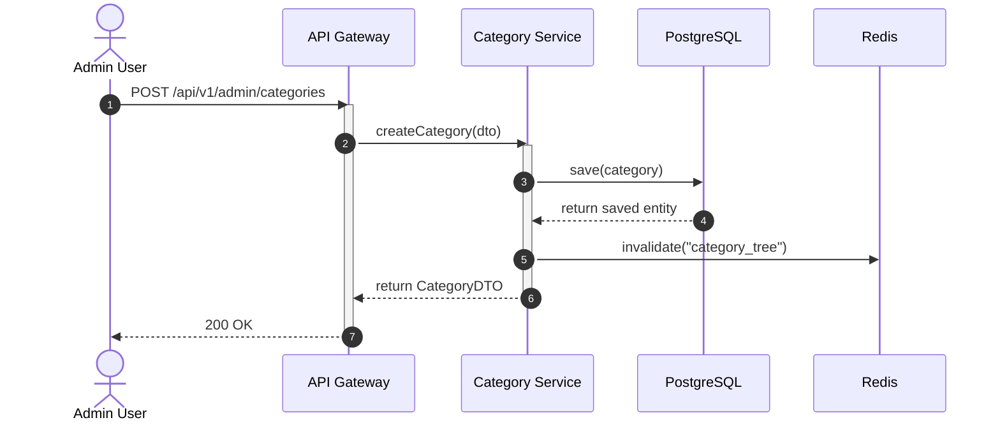
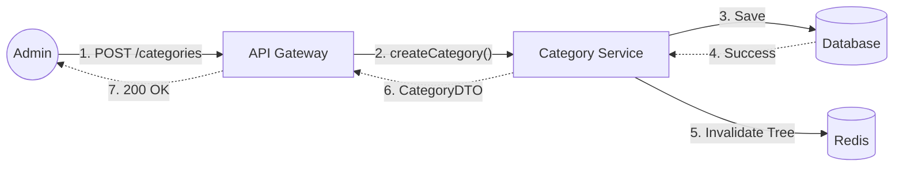

# Biểu đồ hệ thống UC11

## Sequence Diagram



## Communication Diagram



## Activity Diagram

```mermaid
graph TD
    Start((Start))
    Start --> Step1
    Step1["Admin -> API: POST /api/v1/admin/categories"]
    Step1 --> Step2
    Step2["API -> Service: createCategory(dto)"]
    Step2 --> Step3
    Step3["Service -> DB: save(category)"]
    Step3 --> Step4
    Step4["DB -> Service: return saved entity"]
    Step4 --> Step5
    Step5["Service -> Cache: invalidate(\"category_tree\")"]
    Step5 --> Step6
    Step6["Service -> API: return CategoryDTO"]
    Step6 --> Step7
    Step7["API -> Admin: 200 OK"]
    Step7 --> End((End))
```
