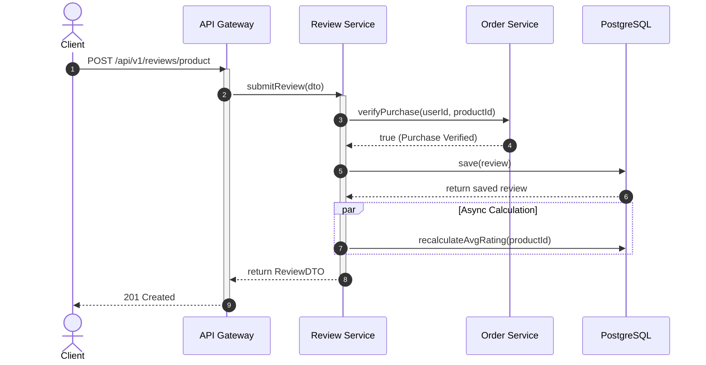
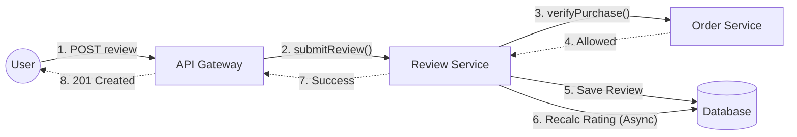
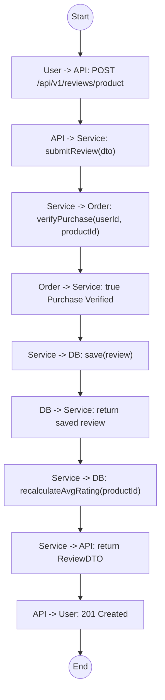

# Biểu đồ hệ thống UC18

## Sequence Diagram

```mermaid
sequenceDiagram
    autonumber
    actor User as Client
    participant API as API Gateway
    participant Service as Review Service
    participant Order as Order Service
    participant DB as PostgreSQL

    User->>API: POST /api/v1/reviews/product
    activate API
    API->>Service: submitReview(dto)
    activate Service
    Service->>Order: verifyPurchase(userId, productId)
    Order-->>Service: true (Purchase Verified)

    Service->>DB: save(review)
    DB-->>Service: return saved review

    par Async Calculation
        Service->>DB: recalculateAvgRating(productId)
    end

    Service-->>API: return ReviewDTO
    deactivate Service
    API-->>User: 201 Created
    deactivate API
```

## Communication Diagram

```mermaid
graph LR
    User((User))
    API[API Gateway]
    Service[Review Service]
    Order[Order Service]
    DB[(Database)]

    User -- "1. POST review" --> API
    API -- "2. submitReview()" --> Service
    Service -- "3. verifyPurchase()" --> Order
    Order -. "4. Allowed" .-> Service
    Service -- "5. Save Review" --> DB
    Service -- "6. Recalc Rating (Async)" --> DB
    Service -. "7. Success" .-> API
    API -. "8. 201 Created" .-> User
```

## Activity Diagram

```mermaid
graph TD
    Start((Start))
    Start --> Step1
    Step1["User -> API: POST /api/v1/reviews/product"]
    Step1 --> Step2
    Step2["API -> Service: submitReview(dto)"]
    Step2 --> Step3
    Step3["Service -> Order: verifyPurchase(userId, productId)"]
    Step3 --> Step4
    Step4["Order -> Service: true Purchase Verified"]
    Step4 --> Step5
    Step5["Service -> DB: save(review)"]
    Step5 --> Step6
    Step6["DB -> Service: return saved review"]
    Step6 --> Step7
    Step7["Service -> DB: recalculateAvgRating(productId)"]
    Step7 --> Step8
    Step8["Service -> API: return ReviewDTO"]
    Step8 --> Step9
    Step9["API -> User: 201 Created"]
    Step9 --> End((End))
```
