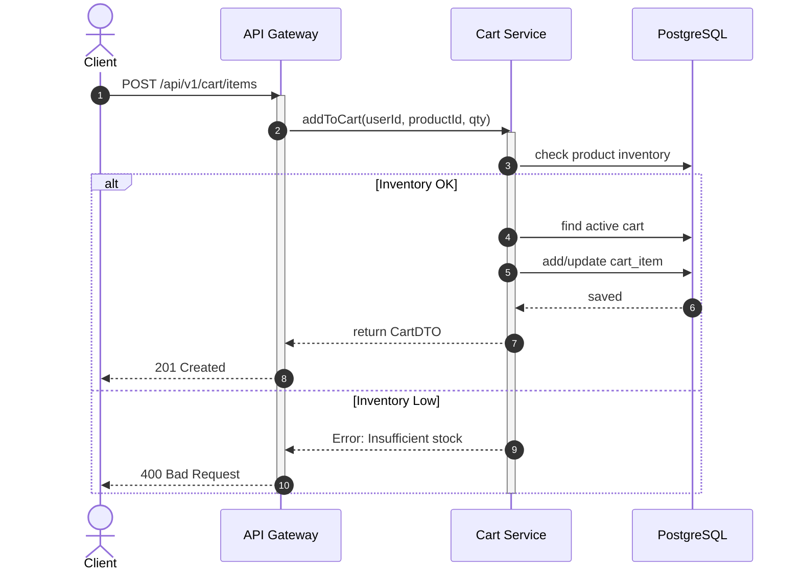
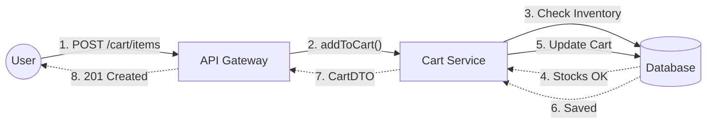
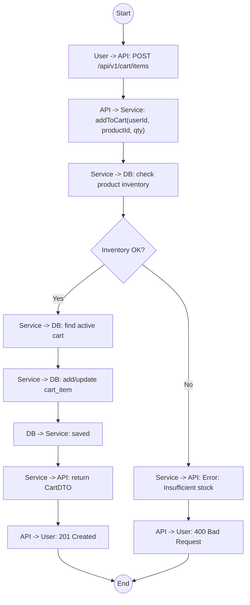

# Biểu đồ hệ thống UC03

## Sequence Diagram

```mermaid
sequenceDiagram
    autonumber
    actor User as Client
    participant API as API Gateway
    participant Service as Cart Service
    participant DB as PostgreSQL

    User->>API: POST /api/v1/cart/items
    activate API
    API->>Service: addToCart(userId, productId, qty)
    activate Service
    Service->>DB: check product inventory
    alt Inventory OK
        Service->>DB: find active cart
        Service->>DB: add/update cart_item
        DB-->>Service: saved
        Service-->>API: return CartDTO
        API-->>User: 201 Created
    else Inventory Low
        Service-->>API: Error: Insufficient stock
        API-->>User: 400 Bad Request
    end
    deactivate Service
    deactivate API
```

## Communication Diagram

```mermaid
graph LR
    User((User))
    API[API Gateway]
    Service[Cart Service]
    DB[(Database)]

    User -- "1. POST /cart/items" --> API
    API -- "2. addToCart()" --> Service
    Service -- "3. Check Inventory" --> DB
    DB -. "4. Stocks OK" .-> Service
    Service -- "5. Update Cart" --> DB
    DB -. "6. Saved" .-> Service
    Service -. "7. CartDTO" .-> API
    API -. "8. 201 Created" .-> User
```

## Activity Diagram

```mermaid
graph TD
    Start((Start))
    Start --> Step1
    Step1["User -> API: POST /api/v1/cart/items"]
    Step1 --> Step2
    Step2["API -> Service: addToCart(userId, productId, qty)"]
    Step2 --> Step3
    Step3["Service -> DB: check product inventory"]
    Step3 --> Condition{Inventory OK?}

    Condition -- Yes --> Step4
    Step4["Service -> DB: find active cart"]
    Step4 --> Step5
    Step5["Service -> DB: add/update cart_item"]
    Step5 --> Step6
    Step6["DB -> Service: saved"]
    Step6 --> Step7
    Step7["Service -> API: return CartDTO"]
    Step7 --> Step8
    Step8["API -> User: 201 Created"]
    Step8 --> End((End))

    Condition -- No --> Step9
    Step9["Service -> API: Error: Insufficient stock"]
    Step9 --> Step10
    Step10["API -> User: 400 Bad Request"]
    Step10 --> End
```
