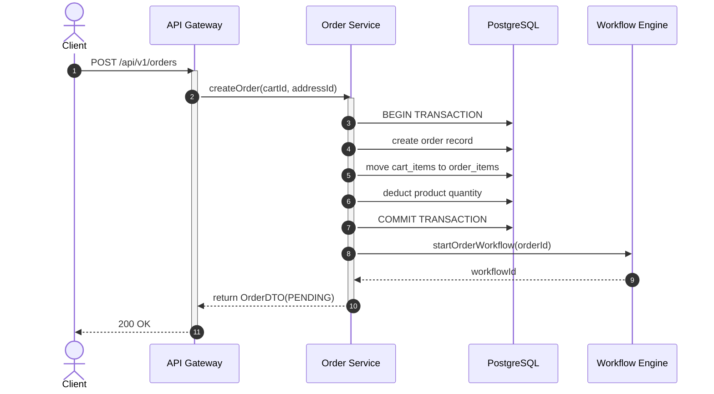
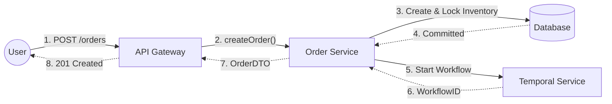
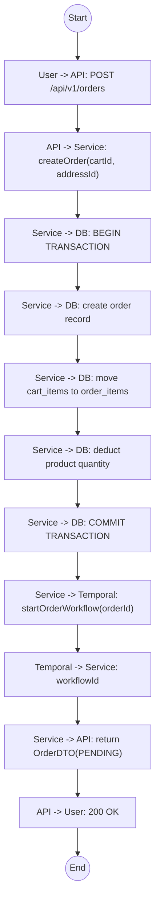

# Biểu đồ hệ thống UC04

## Sequence Diagram

```mermaid
sequenceDiagram
    autonumber
    actor User as Client
    participant API as API Gateway
    participant Service as Order Service
    participant DB as PostgreSQL
    participant Temporal as Workflow Engine

    User->>API: POST /api/v1/orders
    activate API
    API->>Service: createOrder(cartId, addressId)
    activate Service

    Service->>DB: BEGIN TRANSACTION
    Service->>DB: create order record
    Service->>DB: move cart_items to order_items
    Service->>DB: deduct product quantity
    Service->>DB: COMMIT TRANSACTION

    Service->>Temporal: startOrderWorkflow(orderId)
    Temporal-->>Service: workflowId

    Service-->>API: return OrderDTO(PENDING)
    deactivate Service
    API-->>User: 200 OK
    deactivate API
```

## Communication Diagram

```mermaid
graph LR
    User((User))
    API[API Gateway]
    Service[Order Service]
    DB[(Database)]
    Temporal[Temporal Service]

    User -- "1. POST /orders" --> API
    API -- "2. createOrder()" --> Service
    Service -- "3. Create & Lock Inventory" --> DB
    DB -. "4. Committed" .-> Service
    Service -- "5. Start Workflow" --> Temporal
    Temporal -. "6. WorkflowID" .-> Service
    Service -. "7. OrderDTO" .-> API
    API -. "8. 201 Created" .-> User
```

## Activity Diagram

```mermaid
graph TD
    Start((Start))
    Start --> Step1
    Step1["User -> API: POST /api/v1/orders"]
    Step1 --> Step2
    Step2["API -> Service: createOrder(cartId, addressId)"]
    Step2 --> Step3
    Step3["Service -> DB: BEGIN TRANSACTION"]
    Step3 --> Step4
    Step4["Service -> DB: create order record"]
    Step4 --> Step5
    Step5["Service -> DB: move cart_items to order_items"]
    Step5 --> Step6
    Step6["Service -> DB: deduct product quantity"]
    Step6 --> Step7
    Step7["Service -> DB: COMMIT TRANSACTION"]
    Step7 --> Step8
    Step8["Service -> Temporal: startOrderWorkflow(orderId)"]
    Step8 --> Step9
    Step9["Temporal -> Service: workflowId"]
    Step9 --> Step10
    Step10["Service -> API: return OrderDTO(PENDING)"]
    Step10 --> Step11
    Step11["API -> User: 200 OK"]
    Step11 --> End((End))
```
