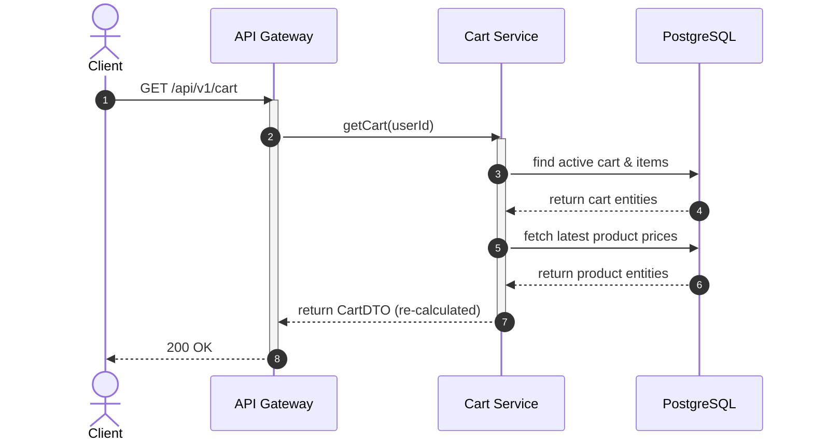
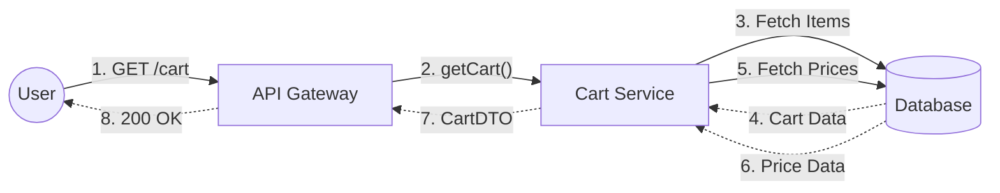
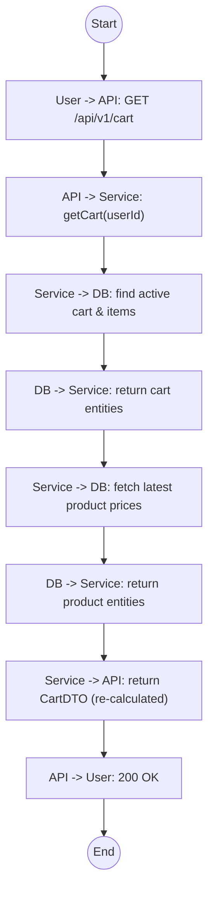

# Biểu đồ hệ thống UC20

## Sequence Diagram

```mermaid
sequenceDiagram
    autonumber
    actor User as Client
    participant API as API Gateway
    participant Service as Cart Service
    participant DB as PostgreSQL

    User->>API: GET /api/v1/cart
    activate API
    API->>Service: getCart(userId)
    activate Service
    Service->>DB: find active cart & items
    DB-->>Service: return cart entities
    Service->>DB: fetch latest product prices
    DB-->>Service: return product entities
    Service-->>API: return CartDTO (re-calculated)
    deactivate Service
    API-->>User: 200 OK
    deactivate API
```

## Communication Diagram

```mermaid
graph LR
    User((User))
    API[API Gateway]
    Service[Cart Service]
    DB[(Database)]

    User -- "1. GET /cart" --> API
    API -- "2. getCart()" --> Service
    Service -- "3. Fetch Items" --> DB
    DB -. "4. Cart Data" .-> Service
    Service -- "5. Fetch Prices" --> DB
    DB -. "6. Price Data" .-> Service
    Service -. "7. CartDTO" .-> API
    API -. "8. 200 OK" .-> User
```

## Activity Diagram

```mermaid
graph TD
    Start((Start))
    Start --> Step1
    Step1["User -> API: GET /api/v1/cart"]
    Step1 --> Step2
    Step2["API -> Service: getCart(userId)"]
    Step2 --> Step3
    Step3["Service -> DB: find active cart & items"]
    Step3 --> Step4
    Step4["DB -> Service: return cart entities"]
    Step4 --> Step5
    Step5["Service -> DB: fetch latest product prices"]
    Step5 --> Step6
    Step6["DB -> Service: return product entities"]
    Step6 --> Step7
    Step7["Service -> API: return CartDTO (re-calculated)"]
    Step7 --> Step8
    Step8["API -> User: 200 OK"]
    Step8 --> End((End))
```
