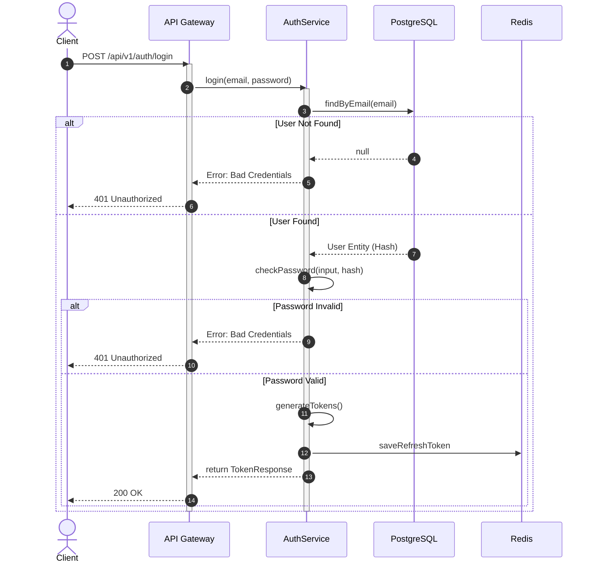
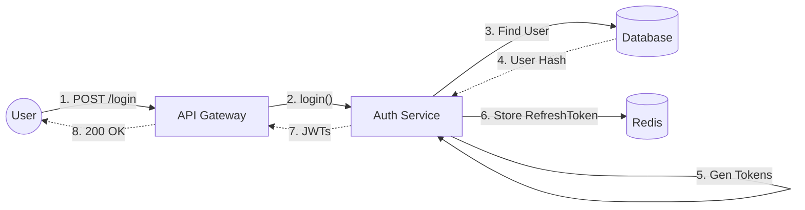
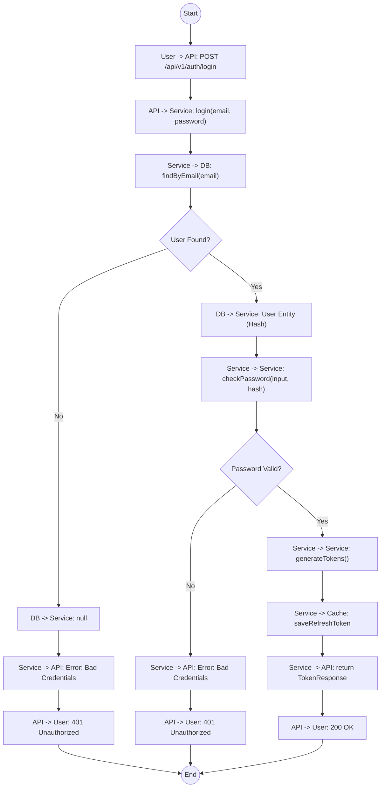

# Biểu đồ hệ thống UC05

## Sequence Diagram

```mermaid
sequenceDiagram
    autonumber
    actor User as Client
    participant API as API Gateway
    participant Service as AuthService
    participant DB as PostgreSQL
    participant Cache as Redis

    User->>API: POST /api/v1/auth/login
    activate API
    API->>Service: login(email, password)
    activate Service
    Service->>DB: findByEmail(email)

    alt User Not Found
        DB-->>Service: null
        Service-->>API: Error: Bad Credentials
        API-->>User: 401 Unauthorized
    else User Found
        DB-->>Service: User Entity (Hash)
        Service->>Service: checkPassword(input, hash)

        alt Password Invalid
            Service-->>API: Error: Bad Credentials
            API-->>User: 401 Unauthorized
        else Password Valid
            Service->>Service: generateTokens()
            Service->>Cache: saveRefreshToken
            Service-->>API: return TokenResponse
            API-->>User: 200 OK
        end
    end
    deactivate Service
    deactivate API
```

## Communication Diagram

```mermaid
graph LR
    User((User))
    API[API Gateway]
    Service[Auth Service]
    DB[(Database)]
    Cache[(Redis)]

    User -- "1. POST /login" --> API
    API -- "2. login()" --> Service
    Service -- "3. Find User" --> DB
    DB -. "4. User Hash" .-> Service
    Service -- "5. Gen Tokens" --> Service
    Service -- "6. Store RefreshToken" --> Cache
    Service -. "7. JWTs" .-> API
    API -. "8. 200 OK" .-> User
```

## Activity Diagram

```mermaid
graph TD
    Start((Start))
    Start --> Step1
    Step1["User -> API: POST /api/v1/auth/login"]
    Step1 --> Step2
    Step2["API -> Service: login(email, password)"]
    Step2 --> Step3
    Step3["Service -> DB: findByEmail(email)"]
    Step3 --> Condition1{User Found?}

    Condition1 -- No --> Step4
    Step4["DB -> Service: null"]
    Step4 --> Step5
    Step5["Service -> API: Error: Bad Credentials"]
    Step5 --> Step6
    Step6["API -> User: 401 Unauthorized"]
    Step6 --> End((End))

    Condition1 -- Yes --> Step7
    Step7["DB -> Service: User Entity (Hash)"]
    Step7 --> Step8
    Step8["Service -> Service: checkPassword(input, hash)"]
    Step8 --> Condition2{Password Valid?}

    Condition2 -- No --> Step9
    Step9["Service -> API: Error: Bad Credentials"]
    Step9 --> Step10
    Step10["API -> User: 401 Unauthorized"]
    Step10 --> End

    Condition2 -- Yes --> Step11
    Step11["Service -> Service: generateTokens()"]
    Step11 --> Step12
    Step12["Service -> Cache: saveRefreshToken"]
    Step12 --> Step13
    Step13["Service -> API: return TokenResponse"]
    Step13 --> Step14
    Step14["API -> User: 200 OK"]
    Step14 --> End
```
