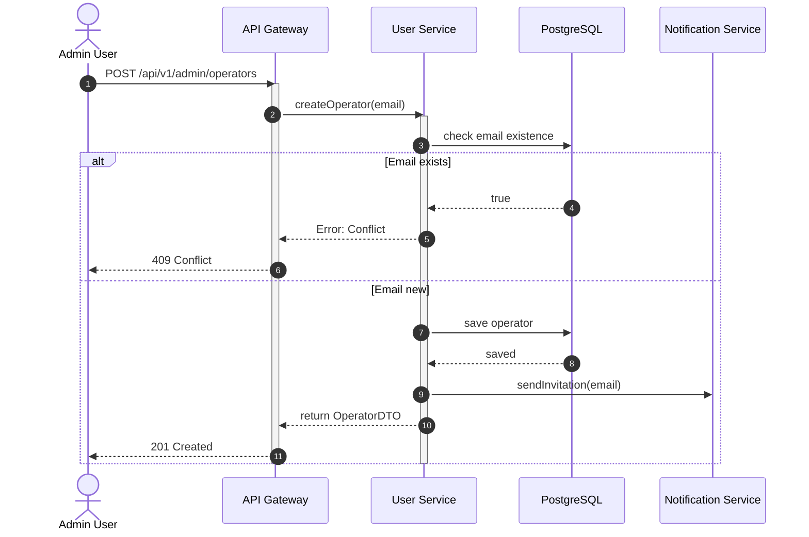
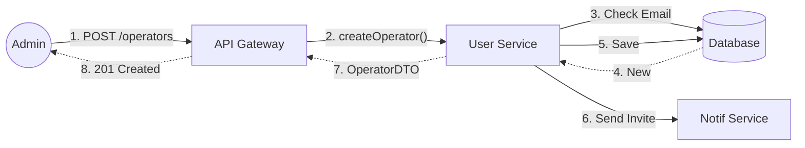
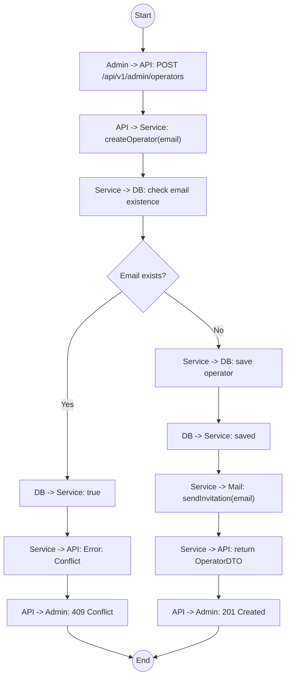

# Biểu đồ hệ thống UC12

## Sequence Diagram

```mermaid
sequenceDiagram
    autonumber
    actor Admin as Admin User
    participant API as API Gateway
    participant Service as User Service
    participant DB as PostgreSQL
    participant Mail as Notification Service

    Admin->>API: POST /api/v1/admin/operators
    activate API
    API->>Service: createOperator(email)
    activate Service
    Service->>DB: check email existence
    alt Email exists
        DB-->>Service: true
        Service-->>API: Error: Conflict
        API-->>Admin: 409 Conflict
    else Email new
        Service->>DB: save operator
        DB-->>Service: saved
        Service->>Mail: sendInvitation(email)
        Service-->>API: return OperatorDTO
        API-->>Admin: 201 Created
    end
    deactivate Service
    deactivate API
```

## Communication Diagram

```mermaid
graph LR
    Admin((Admin))
    API[API Gateway]
    Service[User Service]
    DB[(Database)]
    Mail[Notif Service]

    Admin -- "1. POST /operators" --> API
    API -- "2. createOperator()" --> Service
    Service -- "3. Check Email" --> DB
    DB -. "4. New" .-> Service
    Service -- "5. Save" --> DB
    Service -- "6. Send Invite" --> Mail
    Service -. "7. OperatorDTO" .-> API
    API -. "8. 201 Created" .-> Admin
```

## Activity Diagram

```mermaid
graph TD
    Start((Start))
    Start --> Step1
    Step1["Admin -> API: POST /api/v1/admin/operators"]
    Step1 --> Step2
    Step2["API -> Service: createOperator(email)"]
    Step2 --> Step3
    Step3["Service -> DB: check email existence"]
    Step3 --> Condition{Email exists?}

    Condition -- Yes --> Step4
    Step4["DB -> Service: true"]
    Step4 --> Step5
    Step5["Service -> API: Error: Conflict"]
    Step5 --> Step6
    Step6["API -> Admin: 409 Conflict"]
    Step6 --> End((End))

    Condition -- No --> Step7
    Step7["Service -> DB: save operator"]
    Step7 --> Step8
    Step8["DB -> Service: saved"]
    Step8 --> Step9
    Step9["Service -> Mail: sendInvitation(email)"]
    Step9 --> Step10
    Step10["Service -> API: return OperatorDTO"]
    Step10 --> Step11
    Step11["API -> Admin: 201 Created"]
    Step11 --> End
```
