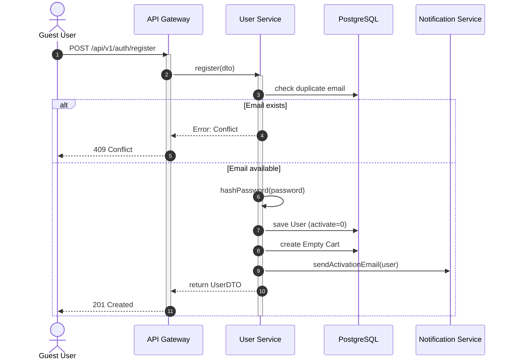
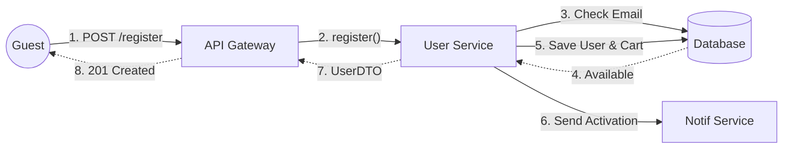
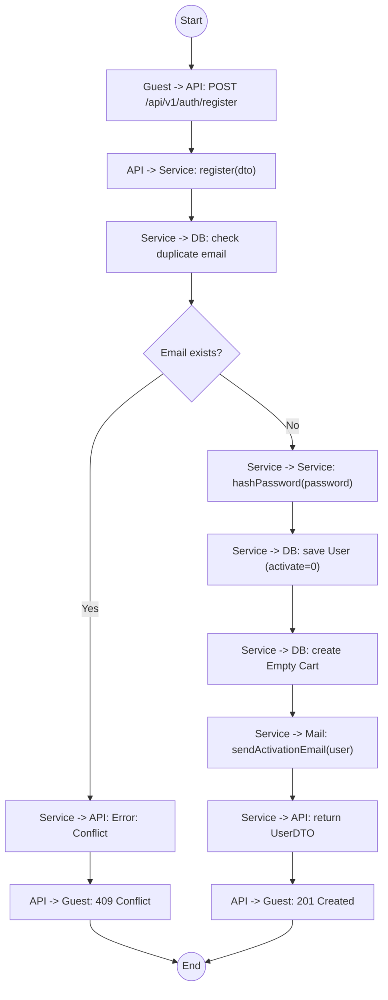

# Biểu đồ hệ thống UC16

## Sequence Diagram

```mermaid
sequenceDiagram
    autonumber
    actor Guest as Guest User
    participant API as API Gateway
    participant Service as User Service
    participant DB as PostgreSQL
    participant Mail as Notification Service

    Guest->>API: POST /api/v1/auth/register
    activate API
    API->>Service: register(dto)
    activate Service
    Service->>DB: check duplicate email
    alt Email exists
        Service-->>API: Error: Conflict
        API-->>Guest: 409 Conflict
    else Email available
        Service->>Service: hashPassword(password)
        Service->>DB: save User (activate=0)
        Service->>DB: create Empty Cart
        Service->>Mail: sendActivationEmail(user)
        Service-->>API: return UserDTO
        API-->>Guest: 201 Created
    end
    deactivate Service
    deactivate API
```

## Communication Diagram

```mermaid
graph LR
    Guest((Guest))
    API[API Gateway]
    Service[User Service]
    DB[(Database)]
    Mail[Notif Service]

    Guest -- "1. POST /register" --> API
    API -- "2. register()" --> Service
    Service -- "3. Check Email" --> DB
    DB -. "4. Available" .-> Service
    Service -- "5. Save User & Cart" --> DB
    Service -- "6. Send Activation" --> Mail
    Service -. "7. UserDTO" .-> API
    API -. "8. 201 Created" .-> Guest
```

## Activity Diagram

```mermaid
graph TD
    Start((Start))
    Start --> Step1
    Step1["Guest -> API: POST /api/v1/auth/register"]
    Step1 --> Step2
    Step2["API -> Service: register(dto)"]
    Step2 --> Step3
    Step3["Service -> DB: check duplicate email"]
    Step3 --> Condition{Email exists?}

    Condition -- Yes --> Step4
    Step4["Service -> API: Error: Conflict"]
    Step4 --> Step5
    Step5["API -> Guest: 409 Conflict"]
    Step5 --> End((End))

    Condition -- No --> Step6
    Step6["Service -> Service: hashPassword(password)"]
    Step6 --> Step7
    Step7["Service -> DB: save User (activate=0)"]
    Step7 --> Step8
    Step8["Service -> DB: create Empty Cart"]
    Step8 --> Step9
    Step9["Service -> Mail: sendActivationEmail(user)"]
    Step9 --> Step10
    Step10["Service -> API: return UserDTO"]
    Step10 --> Step11
    Step11["API -> Guest: 201 Created"]
    Step11 --> End
```
