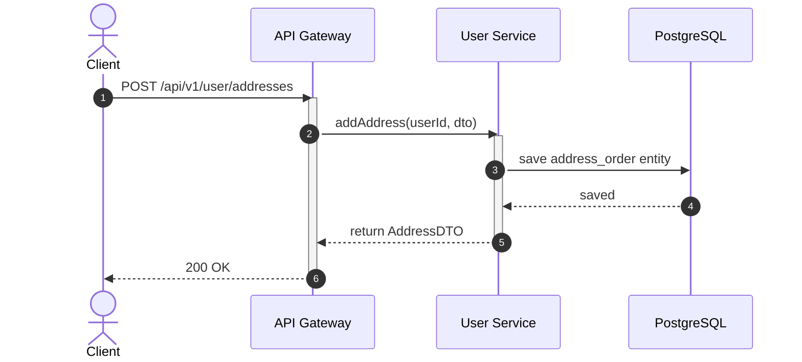
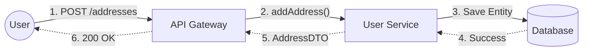
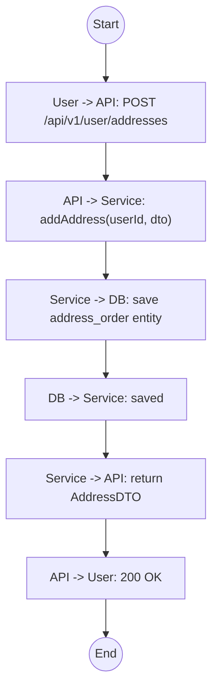

# Biểu đồ hệ thống UC17

## Sequence Diagram

```mermaid
sequenceDiagram
    autonumber
    actor User as Client
    participant API as API Gateway
    participant Service as User Service
    participant DB as PostgreSQL

    User->>API: POST /api/v1/user/addresses
    activate API
    API->>Service: addAddress(userId, dto)
    activate Service
    Service->>DB: save address_order entity
    DB-->>Service: saved
    Service-->>API: return AddressDTO
    deactivate Service
    API-->>User: 200 OK
    deactivate API
```

## Communication Diagram

```mermaid
graph LR
    User((User))
    API[API Gateway]
    Service[User Service]
    DB[(Database)]

    User -- "1. POST /addresses" --> API
    API -- "2. addAddress()" --> Service
    Service -- "3. Save Entity" --> DB
    DB -. "4. Success" .-> Service
    Service -. "5. AddressDTO" .-> API
    API -. "6. 200 OK" .-> User
```

## Activity Diagram

```mermaid
graph TD
    Start((Start))
    Start --> Step1
    Step1["User -> API: POST /api/v1/user/addresses"]
    Step1 --> Step2
    Step2["API -> Service: addAddress(userId, dto)"]
    Step2 --> Step3
    Step3["Service -> DB: save address_order entity"]
    Step3 --> Step4
    Step4["DB -> Service: saved"]
    Step4 --> Step5
    Step5["Service -> API: return AddressDTO"]
    Step5 --> Step6
    Step6["API -> User: 200 OK"]
    Step6 --> End((End))
```
