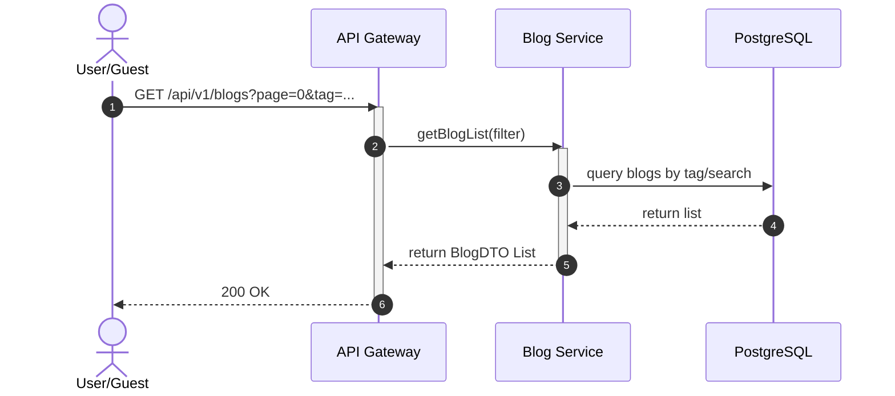
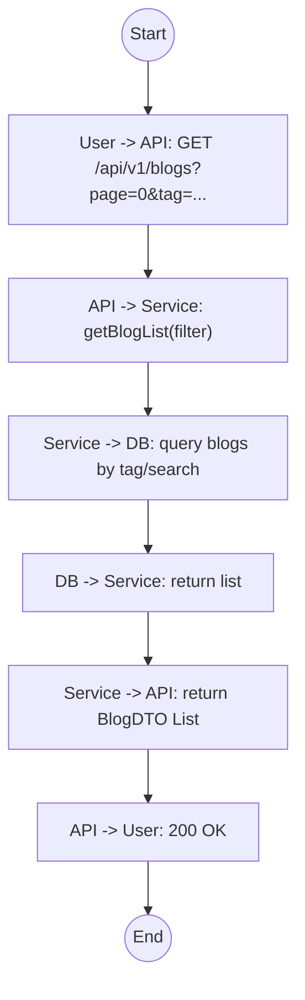

# Biểu đồ hệ thống UC06

## Sequence Diagram



## Communication Diagram

```mermaid
graph LR
    User((User))
    API[API Gateway]
    Service[Blog Service]
    DB[(Database)]

    User --1. GET /blogs--> API
    API --2. getBlogList()--> Service
    Service --3. Query by Tag--> DB
    DB -.4. Results.-> Service
    Service -.5. BlogDTO List.-> API
    API -.6. 200 OK.-> User
```

## Activity Diagram


