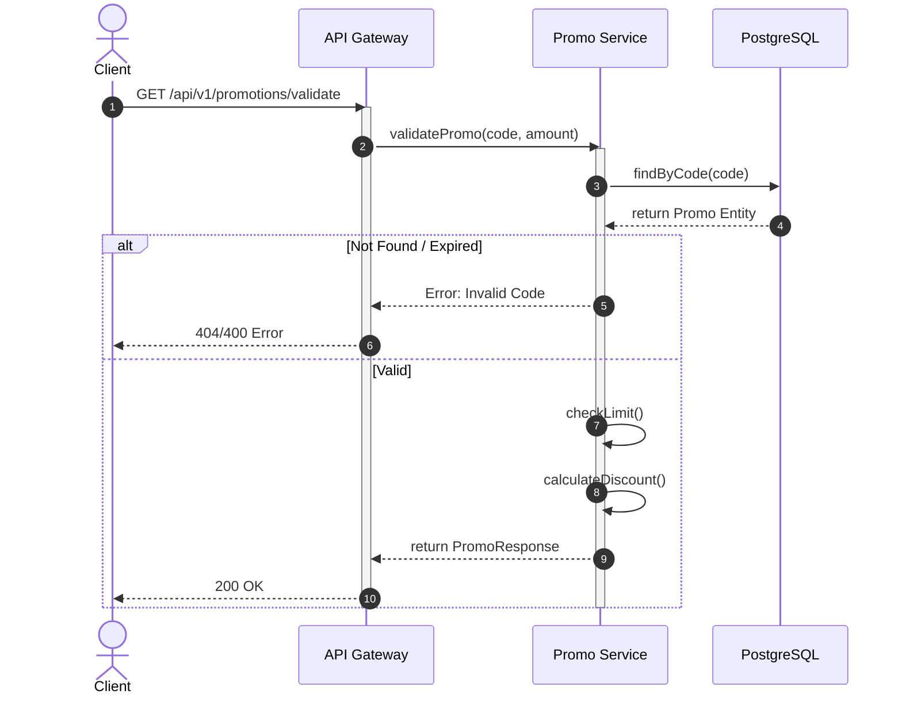
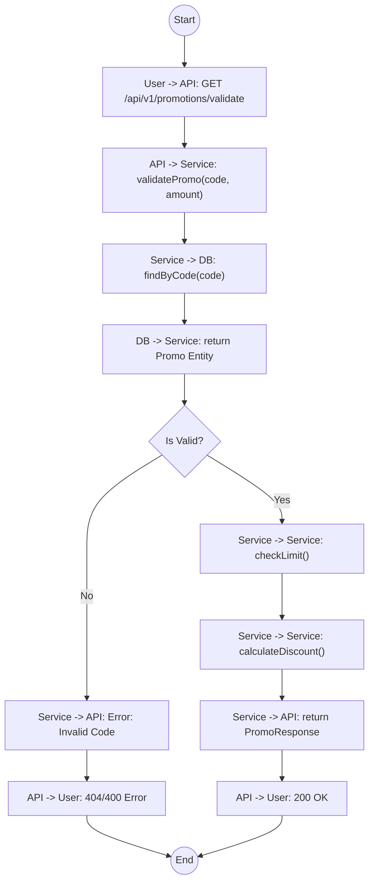

# Biểu đồ hệ thống UC07

## Sequence Diagram



## Communication Diagram

```mermaid
graph LR
    User((User))
    API[API Gateway]
    Service[Promo Service]
    DB[(Database)]

    User --1. GET /validate--> API
    API --2. validatePromo()--> Service
    Service --3. Find Code--> DB
    DB -.4. Promo Entity.-> Service
    Service --5. Check Logic--> Service
    Service -.6. Discount Info.-> API
    API -.7. 200 OK.-> User
```

## Activity Diagram


