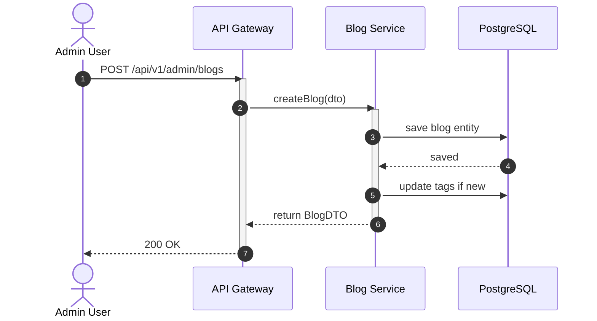
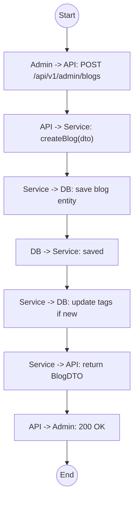

# Biểu đồ hệ thống UC14

## Sequence Diagram



## Communication Diagram

```mermaid
graph LR
    Admin((Admin))
    API[API Gateway]
    Service[Blog Service]
    DB[(Database)]

    Admin --1. POST /blogs--> API
    API --2. createBlog()--> Service
    Service --3. Save Blog--> DB
    DB -.4. Saved.-> Service
    Service --5. Update Tags--> DB
    Service -.6. BlogDTO.-> API
    API -.7. 200 OK.-> Admin
```

## Activity Diagram


