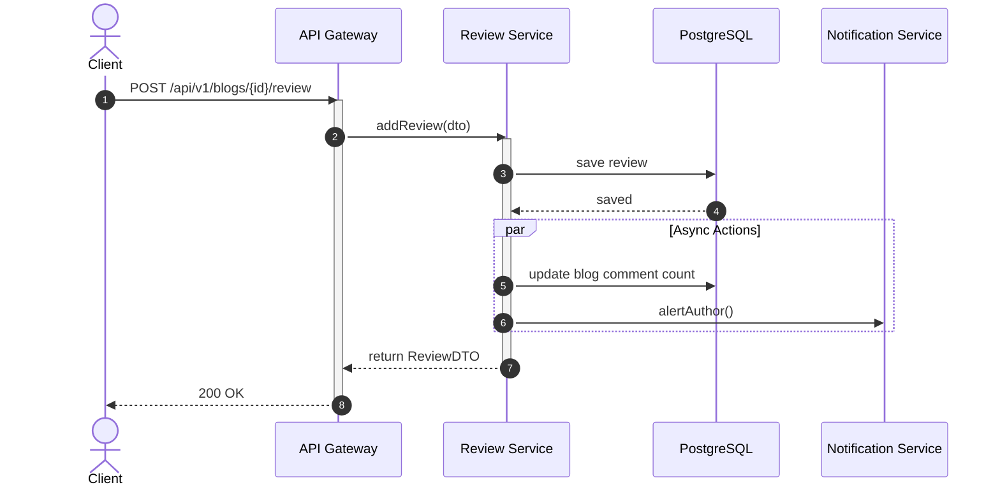
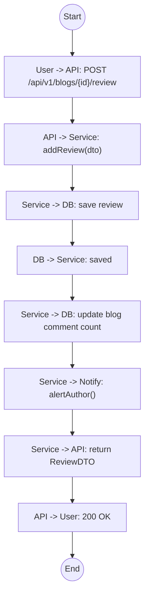

# Biểu đồ hệ thống UC19

## Sequence Diagram



## Communication Diagram

```mermaid
graph LR
    User((User))
    API[API Gateway]
    Service[Review Service]
    DB[(Database)]
    Notify[Notif Service]

    User --1. POST /review--> API
    API --2. addReview()--> Service
    Service --3. Save--> DB
    Service --4. Update Count--> DB
    Service --5. Alert Author--> Notify
    Service -.6. ReviewDTO.-> API
    API -.7. 200 OK.-> User
```

## Activity Diagram


