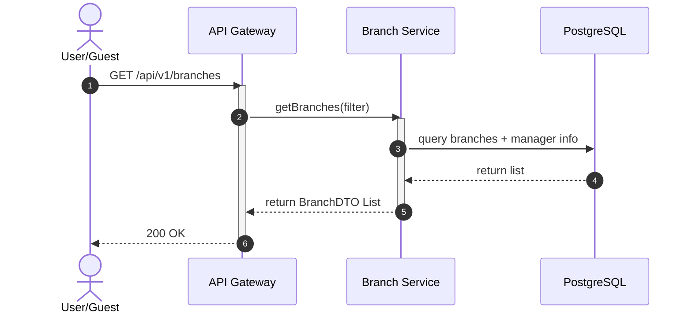
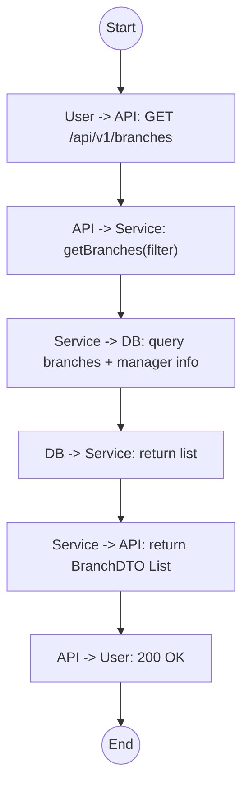

# Biểu đồ hệ thống UC08

## Sequence Diagram



## Communication Diagram

```mermaid
graph LR
    User((User))
    API[API Gateway]
    Service[Branch Service]
    DB[(Database)]

    User --1. GET /branches--> API
    API --2. getBranches()--> Service
    Service --3. Query--> DB
    DB -.4. List.-> Service
    Service -.5. BranchDTO List.-> API
    API -.6. 200 OK.-> User
```

## Activity Diagram


