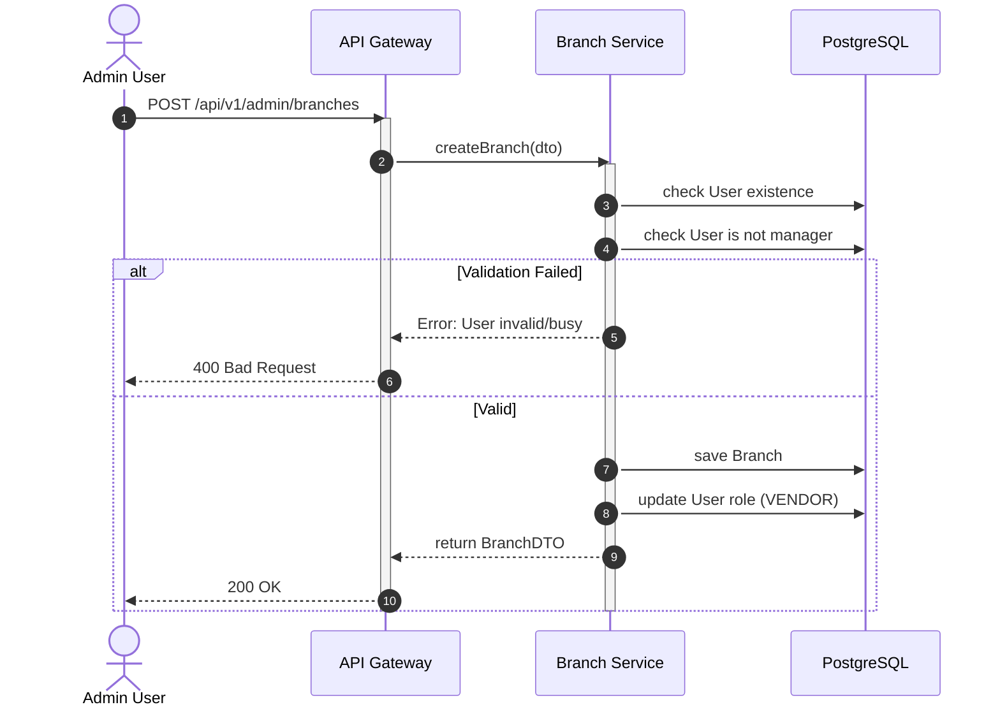

# Biểu đồ hệ thống UC13

## Sequence Diagram



## Communication Diagram

```mermaid
graph LR
    Admin((Admin))
    API[API Gateway]
    Service[Branch Service]
    DB[(Database)]

    Admin --1. POST /branches--> API
    API --2. createBranch()--> Service
    Service --3. Check User--> DB
    DB -.4. Valid.-> Service
    Service --5. Save Branch--> DB
    Service --6. Update Role--> DB
    Service -.7. BranchDTO.-> API
    API -.8. 200 OK.-> Admin
```

## Activity Diagram


