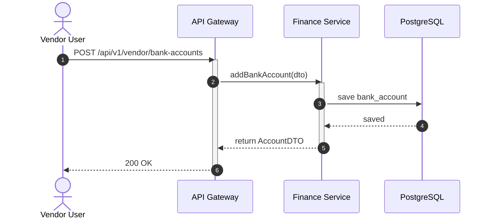
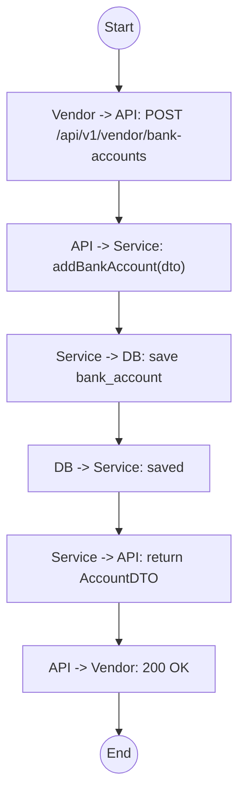

# Biểu đồ hệ thống UC21

## Sequence Diagram



## Communication Diagram

```mermaid
graph LR
    Vendor((Vendor))
    API[API Gateway]
    Service[Finance Service]
    DB[(Database)]

    Vendor --1. POST /bank-accounts--> API
    API --2. addAccount()--> Service
    Service --3. Save--> DB
    DB -.4. Saved.-> Service
    Service -.5. AccountDTO.-> API
    API -.6. 200 OK.-> Vendor
```

## Activity Diagram


