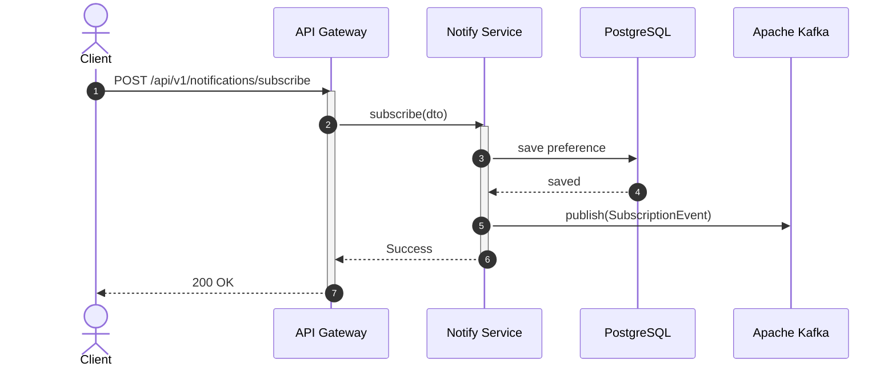
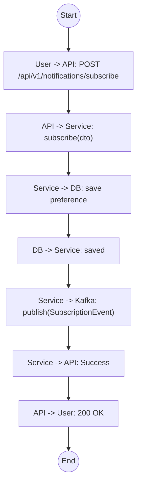

# Biểu đồ hệ thống UC09

## Sequence Diagram



## Communication Diagram

```mermaid
graph LR
    User((User))
    API[API Gateway]
    Service[Notify Service]
    DB[(Database)]
    Kafka[Kafka Broker]

    User --1. POST /subscribe--> API
    API --2. subscribe()--> Service
    Service --3. Save Prefs--> DB
    Service --4. Publish Event--> Kafka
    Service -.5. Success.-> API
    API -.6. 200 OK.-> User
```

## Activity Diagram


