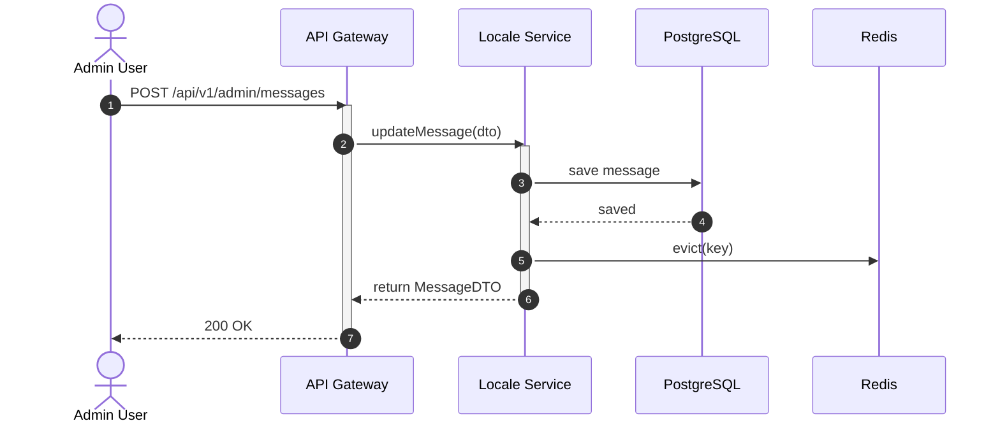
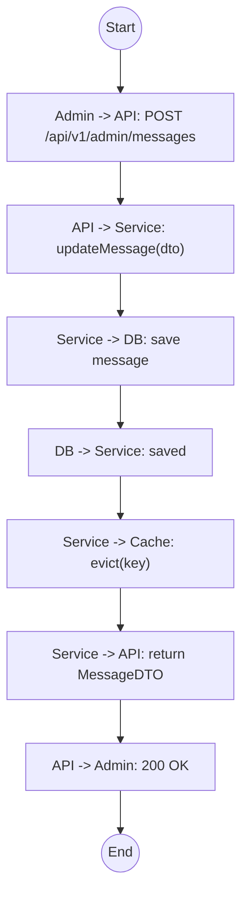

# Biểu đồ hệ thống UC15

## Sequence Diagram



## Communication Diagram

```mermaid
graph LR
    Admin((Admin))
    API[API Gateway]
    Service[Locale Service]
    DB[(Database)]
    Cache[(Redis)]

    Admin --1. POST /messages--> API
    API --2. updateMessage()--> Service
    Service --3. Save Msg--> DB
    Service --4. Evict Cache--> Cache
    Service -.5. MessageDTO.-> API
    API -.6. 200 OK.-> Admin
```

## Activity Diagram


