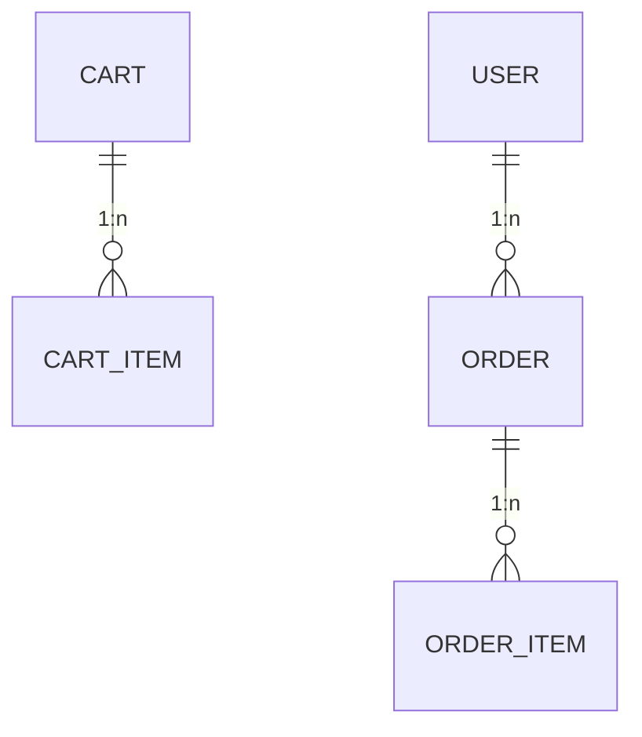

# Schema: Quản lý Đơn hàng

Module này quản lý vòng đời của giao dịch, từ khi sản phẩm nằm trong giỏ hàng đến khi đơn hàng được chốt và thanh toán thành công.

## 1. Sơ đồ Thực thể (ERD)

## 2. Chi tiết Định nghĩa Bảng

### Bảng `order`

Bản ghi trung tâm của giao dịch mua sắm.

| Cột           | Kiểu dữ liệu | Ràng buộc | Mô tả                                 |
| :------------ | :----------- | :-------- | :------------------------------------ |
| `uuid_order`  | varchar(40)  | PK        | Khóa chính UUID                       |
| `user_id`     | varchar(40)  | FK        | Liên kết người mua                    |
| `status`      | smallint     | Default 0 | Trạng thái (0: Pending, 1: Paid, ...) |
| `grand_total` | double       | Not Null  | Tổng tiền phải thanh toán             |
| `promo`       | varchar(50)  |           | Mã giảm giá đã dùng                   |

### Bảng `order_item`

Snapshot thông tin sản phẩm tại thời điểm mua (Giá, Số lượng) để đảm bảo không bị thay đổi bởi các cập nhật sau này trong bảng `product`.

### Bảng `cart_item`

Lưu trữ trạng thái tạm thời của các sản phẩm người dùng đã chọn.

---

> [!CAUTION]
> Dữ liệu trong `order_item` phải được chốt giá (hardcoded) tại thời điểm Insert để phục vụ đối soát tài chính chính xác.
