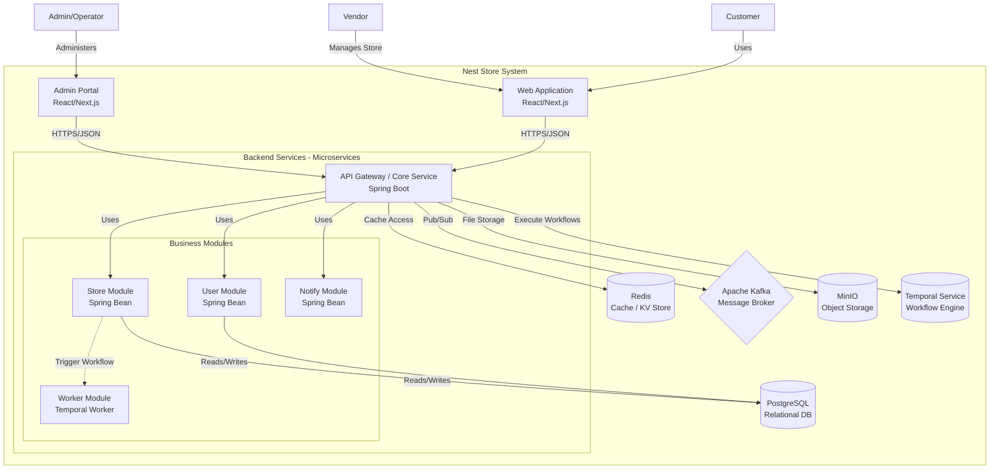
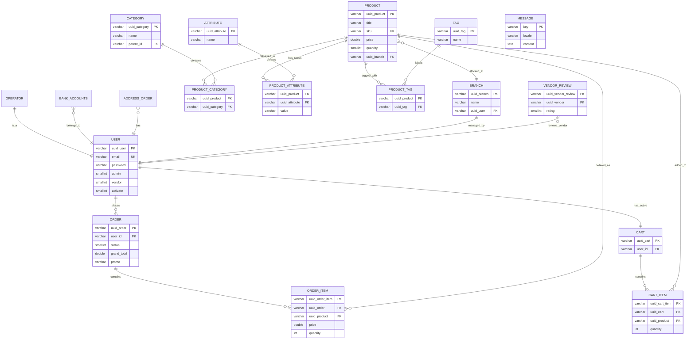
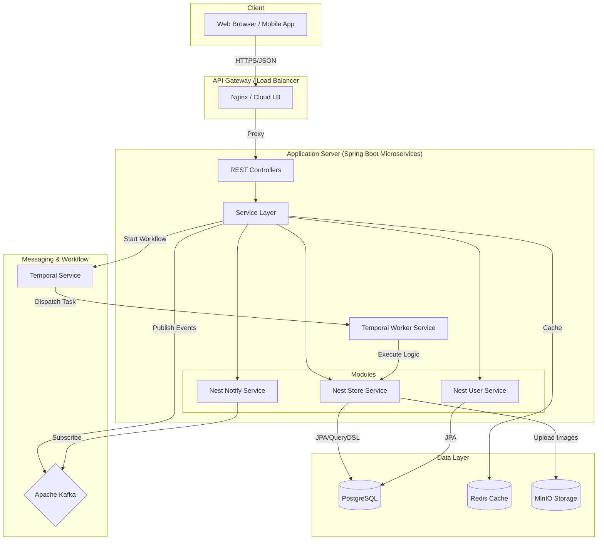
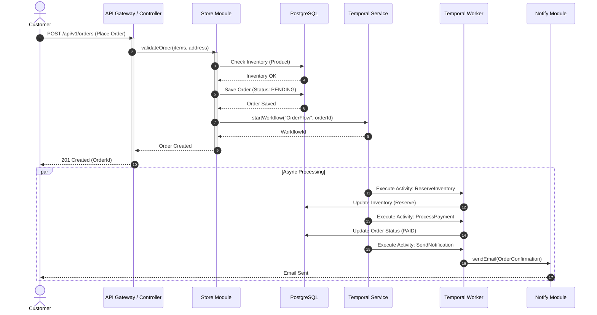
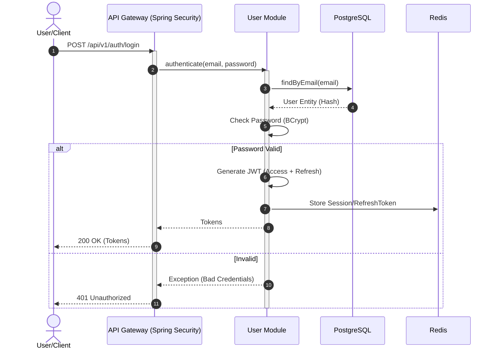

# System Diagrams

Tài liệu này tổng hợp các biểu đồ kiến trúc và thiết kế cơ sở dữ liệu cho hệ thống Nest Store.

## 1. High-Level Architecture (C4 Model)

Mô hình kiến trúc tổng quan của hệ thống Nest Store, được thiết kế theo hướng **Microservices**.

## 2. Comprehensive Entity Relationship Diagram (ERD)

Sơ đồ tổng hợp các thực thể chính trong hệ thống và mối quan hệ giữa chúng.

## 3. Technology Stack & Component Interaction

Chi tiết về tương tác giữa các thành phần công nghệ (dựa trên tài liệu Backend Stack).

## 4. Sequence Diagrams

### 4.1. Order Processing Flow

Quy trình xử lý đơn hàng từ lúc khách hàng đặt mua cho đến khi hệ thống tiếp nhận và xử lý background.

### 4.2. Authentication Flow

Quy trình đăng nhập và lấy Token truy cập.

