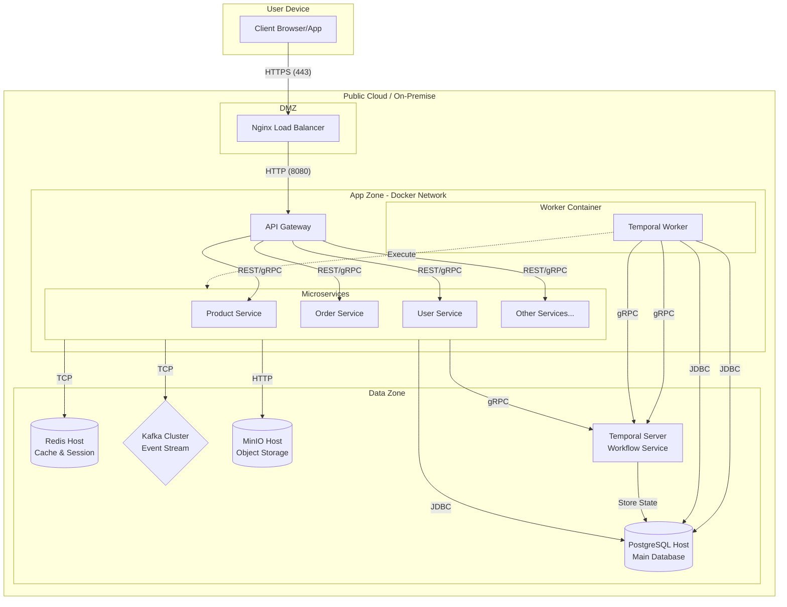

# Triển khai và Vận hành

Tài liệu này hướng dẫn cách triển khai hệ thống Nest Store (Microservices) lên các môi trường (Staging/Production) sử dụng công nghệ Docker và CI/CD.

## 1. Môi trường Yêu cầu

Hệ thống yêu cầu các thành phần sau để hoạt động ổn định:

- **Runtime:** Java 21 (JRE).
- **Infrastucture:**
  - Docker & Docker Compose.
  - Kubernetes (Tùy chọn cho việc scale cụm worker).
  - MinIO (Lưu trữ file).
  - PostgreSQL 15+.

## 2. Quy trình Triển khai (Docker)

### Build Ứng dụng

Sử dụng Gradle để build file JAR:

```bash
./gradlew bootJar
```

### Dockerize

Sử dụng Dockerfile được tối ưu hóa cho Spring Boot 3:

```dockerfile
FROM eclipse-temurin:21-jre-alpine
COPY build/libs/*.jar app.jar
ENTRYPOINT ["java", "-jar", "/app.jar"]
```

### Chạy hệ thống với Docker Compose

Hệ thống bao gồm các microservices chạy trên các container riêng biệt và các container phụ trợ (DB, Redis, Temporal):

```bash
docker-compose up -d
```

## 3. Cấu hình Quan trọng

Các tham số cấu hình được quản lý qua biến môi trường (Environment Variables):

- `SPRING_DATASOURCE_URL`: Kết nối PostgreSQL.
- `TEMPORAL_ADDRESS`: Địa chỉ Temporal Cluster.
- `KAFKA_BOOTSTRAP_SERVERS`: Địa chỉ cụm Kafka.
- `MINIO_ENDPOINT`: Kết nối lưu trữ file.

## 4. Giám sát & Nhật ký (Monitoring & Logs)

- **Logs:** Ứng dụng xuất log chuẩn ra STDOUT/STDERR để thu thập bằng EFK Stack hoặc Loki.
- **Monitoring:** Sử dụng **Spring Boot Actuator** tích hợp với **Prometheus** và **Grafana** để theo dõi các chỉ số:
  - Heap memory.
  - CPU usage.
  - Database connection pool.
  - Temporal task queue backlog.

## 5. Sơ đồ Triển khai (Deployment Diagram)

Sơ đồ thể hiện cấu hình của các nút xử lý (nodes) và các thành phần phần mềm được triển khai.


