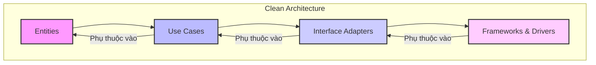
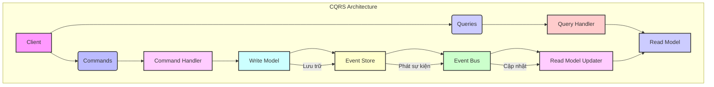

# Tài liệu thiết kế hệ thống Microservice

## Giới thiệu

Tài liệu này trình bày thiết kế kiến trúc của hệ thống SaaS quản lý dịch vụ dựa trên mô hình microservice. Chúng tôi sẽ phân chia hệ thống thành các dịch vụ nhỏ, độc lập, dễ quản lý và mở rộng. Các công nghệ chính được sử dụng bao gồm Java Spring, PostgreSQL, Kafka, Redis và Kubernetes. Ngoài ra, tài liệu cũng đề xuất áp dụng các mẫu thiết kế kiến trúc như Clean Architecture và CQRS để đảm bảo tính bền vững, khả năng kiểm thử và hiệu suất của hệ thống.

## 1. Kiến trúc tổng quan

Hệ thống được thiết kế theo kiến trúc microservice, nơi mỗi chức năng kinh doanh được đóng gói thành một dịch vụ độc lập. Các dịch vụ này giao tiếp với nhau thông qua API (RESTful hoặc gRPC) và hệ thống nhắn tin bất đồng bộ (Kafka). API Gateway đóng vai trò là điểm truy cập duy nhất cho các client, xử lý xác thực, ủy quyền, giới hạn tốc độ và định tuyến yêu cầu.

```mermaid
C4Context
    title Hệ thống SaaS quản lý dịch vụ

    Person(admin, "Admin", "Quản lý toàn bộ hệ thống")
    Person(end_user, "End User", "Người dùng cuối sử dụng dịch vụ")
    Person(developer, "Developer", "Người dùng cuối tích hợp API")

    System(payment_provider, "Payment Provider", "Hệ thống thanh toán bên ngoài (Stripe, Momo)")

    System_Boundary(saas_system, "Hệ thống SaaS quản lý dịch vụ") {
        System(api_gateway, "API Gateway", "Cổng API, xác thực, định tuyến")
        System(auth_service, "Auth Service", "Quản lý xác thực và ủy quyền")
        System(user_service, "User Service", "Quản lý thông tin người dùng và vai trò")
        System(service_catalog_service, "Service Catalog Service", "Quản lý danh mục dịch vụ và cấu hình")
        System(plan_management_service, "Plan Management Service", "Quản lý gói dịch vụ và hạn ngạch")
        System(subscription_service, "Subscription Service", "Quản lý đăng ký gói dịch vụ")
        System(payment_service, "Payment Service", "Xử lý giao dịch thanh toán")
        System(quota_usage_service, "Quota & Usage Service", "Theo dõi và quản lý hạn ngạch sử dụng")
        System(notification_service, "Notification Service", "Gửi thông báo qua email và trong ứng dụng")
        System(reporting_service, "Reporting Service", "Tạo và quản lý báo cáo")
        System(api_key_service, "API Key Service", "Quản lý API Key cho Developer")
        System(logging_monitoring_service, "Logging & Monitoring Service", "Thu thập log và giám sát hệ thống")
        System(background_job_service, "Background Job Service", "Xử lý các tác vụ nền")
        System(third_party_service_adapter, "Third-Party Service Adapter", "Kết nối với các dịch vụ bên ngoài (eKYC, OCR)")
    }

    admin --> api_gateway
    end_user --> api_gateway
    developer --> api_gateway

    api_gateway --> auth_service
    api_gateway --> user_service
    api_gateway --> service_catalog_service
    api_gateway --> plan_management_service
    api_gateway --> subscription_service
    api_gateway --> payment_service
    api_gateway --> quota_usage_service
    api_gateway --> api_key_service
    api_gateway --> third_party_service_adapter

    auth_service --> user_service
    subscription_service --> plan_management_service
    subscription_service --> payment_service
    payment_service --> payment_provider
    quota_usage_service --> logging_monitoring_service
    notification_service --> user_service
    reporting_service --> quota_usage_service
    reporting_service --> logging_monitoring_service
    background_job_service --> quota_usage_service
    background_job_service --> user_service
    background_job_service --> subscription_service

    logging_monitoring_service --> api_gateway
    logging_monitoring_service --> auth_service
    logging_monitoring_service --> user_service
    logging_monitoring_service --> service_catalog_service
    logging_monitoring_service --> plan_management_service
    logging_monitoring_service --> subscription_service
    logging_monitoring_service --> payment_service
    logging_monitoring_service --> quota_usage_service
    logging_monitoring_service --> notification_service
    logging_monitoring_service --> reporting_service
    logging_monitoring_service --> api_key_service
    logging_monitoring_service --> background_job_service
    logging_monitoring_service --> third_party_service_adapter

    payment_provider --> payment_service : Webhook

    api_gateway .> notification_service : Async
    quota_usage_service .> notification_service : Async
    payment_service .> notification_service : Async
    background_job_service .> notification_service : Async

    Rel(admin, saas_system, "Quản lý")
    Rel(end_user, saas_system, "Sử dụng")
    Rel(developer, saas_system, "Tích hợp")
    Rel(saas_system, payment_provider, "Xử lý thanh toán")
```

## 2. Phân chia Microservice

Dựa trên các Use Case đã phân tích, hệ thống được chia thành các microservice chính sau:

### 2.1. **Auth Service**

- **Chức năng**: Quản lý xác thực người dùng (đăng ký, đăng nhập, quên mật khẩu, đổi mật khẩu, xác thực email, OAuth2), quản lý phiên (session/token).
- **Công nghệ**: Java Spring Security, JWT.
- **Cơ sở dữ liệu**: PostgreSQL (lưu trữ thông tin xác thực, token).

### 2.2. **User Service**

- **Chức năng**: Quản lý thông tin người dùng (profile, avatar, trạng thái tài khoản), quản lý vai trò (roles) và phân quyền cho người dùng.
- **Công nghệ**: Java Spring Boot.
- **Cơ sở dữ liệu**: PostgreSQL (lưu trữ thông tin `USERS`, `ROLES`, `USER_ROLES`).

### 2.3. **Service Catalog Service**

- **Chức năng**: Quản lý danh mục các dịch vụ mà hệ thống cung cấp (STT, eKYC, OCR), cấu hình endpoint, mô tả, giá cả, trạng thái kích hoạt.
- **Công nghệ**: Java Spring Boot.
- **Cơ sở dữ liệu**: PostgreSQL (lưu trữ thông tin `SERVICES`).

### 2.4. **Plan Management Service**

- **Chức năng**: Quản lý các gói dịch vụ (Free, Trial, Premium, Enterprise), cấu hình giá, chu kỳ thanh toán, quota mặc định cho từng dịch vụ trong gói.
- **Công nghệ**: Java Spring Boot.
- **Cơ sở dữ liệu**: PostgreSQL (lưu trữ thông tin `PLANS`, `PLAN_QUOTAS`).

### 2.5. **Subscription Service**

- **Chức năng**: Quản lý đăng ký gói dịch vụ của người dùng, nâng cấp/hủy/gia hạn gói, duyệt yêu cầu nâng cấp/tăng quota đặc biệt.
- **Công nghệ**: Java Spring Boot.
- **Cơ sở dữ liệu**: PostgreSQL (lưu trữ thông tin `SUBSCRIPTIONS`).

### 2.6. **Payment Service**

- **Chức năng**: Xử lý các giao dịch thanh toán, tích hợp với các Payment Provider (Stripe, Momo), xử lý webhook thanh toán thành công/thất bại, refund, recurring payments.
- **Công nghệ**: Java Spring Boot.
- **Cơ sở dữ liệu**: PostgreSQL (lưu trữ thông tin `PAYMENTS`).

### 2.7. **Quota & Usage Service**

- **Chức năng**: Theo dõi và quản lý hạn ngạch sử dụng của từng người dùng cho từng dịch vụ, cập nhật usage real-time, cảnh báo khi usage gần đạt limit, reset quota, xuất báo cáo usage.
- **Công nghệ**: Java Spring Boot, Redis (cho usage real-time).
- **Cơ sở dữ liệu**: PostgreSQL (lưu trữ `USAGE_LOGS` tổng hợp), Redis (lưu trữ `USAGE_LOGS` tạm thời và quota).

### 2.8. **Notification Service**

- **Chức năng**: Gửi các loại thông báo (email, in-app notifications) đến người dùng, quản lý template thông báo.
- **Công nghệ**: Java Spring Boot, Kafka (để nhận sự kiện thông báo).
- **Cơ sở dữ liệu**: PostgreSQL (lưu trữ `NOTIFICATIONS`).

### 2.9. **Reporting Service**

- **Chức năng**: Tạo các báo cáo phân tích (doanh thu, usage, hiệu suất dịch vụ), dashboard tổng quan, xuất báo cáo nhiều định dạng.
- **Công nghệ**: Java Spring Boot, tích hợp với các công cụ BI/Analytics (nếu có).
- **Cơ sở dữ liệu**: PostgreSQL (cho dữ liệu báo cáo), có thể sử dụng Data Warehouse riêng.

### 2.10. **API Key Service**

- **Chức năng**: Quản lý API Key cho Developer (tạo, xem, đổi tên, mô tả, regenerate, thu hồi, cấu hình permissions, expiry date, xem usage cho từng API Key).
- **Công nghệ**: Java Spring Boot.
- **Cơ sở dữ liệu**: PostgreSQL (lưu trữ thông tin `API_KEYS`).

### 2.11. **Logging & Monitoring Service**

- **Chức năng**: Thu thập, lưu trữ và hiển thị log từ tất cả các microservice, giám sát hiệu suất hệ thống, health check các microservice.
- **Công nghệ**: ELK Stack (Elasticsearch, Logstash, Kibana) hoặc Prometheus/Grafana.
- **Cơ sở dữ liệu**: Elasticsearch (cho logs), Prometheus (cho metrics).

### 2.12. **Background Job Service**

- **Chức năng**: Xử lý các tác vụ nền định kỳ hoặc không đồng bộ (cleanup expired tokens, archive old logs, update usage statistics, send scheduled notifications, backup databases, monitor system resources).
- **Công nghệ**: Java Spring Batch, Spring Scheduler, Kafka (cho các tác vụ không đồng bộ).
- **Cơ sở dữ liệu**: PostgreSQL.

### 2.13. **Third-Party Service Adapter**

- **Chức năng**: Cung cấp giao diện chuẩn để tích hợp với các dịch vụ bên ngoài (ví dụ: các dịch vụ AI/ML như eKYC, OCR, STT).
- **Công nghệ**: Java Spring Boot.
- **Cơ sở dữ liệu**: Không có cơ sở dữ liệu riêng, chỉ là lớp trung gian.

## 3. Công nghệ sử dụng

### 3.1. **Ngôn ngữ lập trình & Framework**

- **Java**: Ngôn ngữ lập trình chính cho các microservice, nổi bật với hiệu suất, tính ổn định và hệ sinh thái lớn.
- **Spring Boot**: Framework hàng đầu cho Java, giúp phát triển microservice nhanh chóng với khả năng tự cấu hình và tích hợp dễ dàng.
- **Spring Cloud**: Bộ công cụ hỗ trợ phát triển các ứng dụng phân tán, bao gồm Service Discovery, Circuit Breaker, Load Balancing, Config Server.

### 3.2. **Cơ sở dữ liệu**

- **PostgreSQL**: Cơ sở dữ liệu quan hệ mã nguồn mở mạnh mẽ, đáng tin cậy, hỗ trợ JSONB, phù hợp cho dữ liệu có cấu trúc và phức tạp. Được sử dụng làm cơ sở dữ liệu chính cho hầu hết các microservice.
- **Redis**: Cơ sở dữ liệu NoSQL dạng key-value, được sử dụng làm cache, lưu trữ dữ liệu tạm thời (ví dụ: usage real-time, session, rate limit counters) và hàng đợi tin nhắn (message queue) cho các tác vụ nhỏ.

### 3.3. **Hệ thống nhắn tin bất đồng bộ**

- **Apache Kafka**: Nền tảng streaming phân tán hiệu suất cao, được sử dụng để truyền tải các sự kiện giữa các microservice (ví dụ: sự kiện đăng ký mới, sự kiện thanh toán, sự kiện sử dụng API). Kafka đảm bảo tính nhất quán dữ liệu, khả năng mở rộng và chịu lỗi.

### 3.4. **Triển khai & Quản lý Container**

- **Docker**: Công nghệ container hóa để đóng gói các microservice cùng với tất cả các phụ thuộc của chúng, đảm bảo môi trường chạy nhất quán từ phát triển đến sản xuất.
- **Kubernetes (K8s)**: Nền tảng điều phối container mạnh mẽ, được sử dụng để tự động hóa việc triển khai, mở rộng và quản lý các ứng dụng container hóa. K8s cung cấp khả năng tự phục hồi, cân bằng tải, và quản lý cấu hình.

### 3.5. **API Gateway**

- **Spring Cloud Gateway / Zuul**: Framework API Gateway dựa trên Spring, cung cấp khả năng định tuyến động, lọc yêu cầu, xác thực, giới hạn tốc độ.

### 3.6. **Giám sát & Ghi log**

- **Prometheus & Grafana**: Prometheus để thu thập metrics từ các microservice, Grafana để trực quan hóa dữ liệu và tạo dashboard giám sát.
- **ELK Stack (Elasticsearch, Logstash, Kibana)**: Logstash để thu thập và xử lý log, Elasticsearch để lưu trữ và tìm kiếm log, Kibana để trực quan hóa log.

## 4. Mẫu thiết kế kiến trúc đề xuất

### 4.1. **Clean Architecture**

Clean Architecture là một mẫu thiết kế giúp tách biệt các lớp ứng dụng thành các vòng tròn đồng tâm, đảm bảo sự độc lập của các lớp bên trong khỏi các thay đổi ở lớp bên ngoài. Điều này giúp hệ thống dễ kiểm thử, dễ bảo trì và độc lập với framework/cơ sở dữ liệu.



- **Entities**: Chứa các quy tắc nghiệp vụ cốt lõi của ứng dụng, độc lập với bất kỳ lớp nào khác.
- **Use Cases (Interactors)**: Chứa các quy tắc nghiệp vụ cụ thể của ứng dụng, điều phối luồng dữ liệu đến và đi từ Entities. Chúng không biết về giao diện người dùng hoặc cơ sở dữ liệu.
- **Interface Adapters**: Chuyển đổi dữ liệu từ định dạng phù hợp với Use Cases và Entities sang định dạng phù hợp với các Frameworks & Drivers (ví dụ: Controllers, Presenters, Gateways, Repositories).
- **Frameworks & Drivers**: Chứa các chi tiết triển khai như cơ sở dữ liệu, framework web, UI. Các lớp này phụ thuộc vào các lớp bên trong.

**Lợi ích**: Tăng khả năng kiểm thử, dễ dàng thay đổi công nghệ, tách biệt rõ ràng các mối quan tâm.

### 4.2. **CQRS (Command Query Responsibility Segregation)**

CQRS là một mẫu thiết kế tách biệt các hoạt động đọc (Queries) và ghi (Commands) dữ liệu. Điều này cho phép tối ưu hóa độc lập cho từng loại hoạt động, cải thiện hiệu suất, khả năng mở rộng và tính linh hoạt.



- **Commands**: Các đối tượng đại diện cho các yêu cầu thay đổi trạng thái dữ liệu (ví dụ: `CreateUserCommand`, `UpdateSubscriptionCommand`). Chúng được xử lý bởi `Command Handler`.
- **Queries**: Các đối tượng đại diện cho các yêu cầu đọc dữ liệu (ví dụ: `GetUserByIdQuery`, `GetUsageReportQuery`). Chúng được xử lý bởi `Query Handler`.
- **Write Model**: Mô hình dữ liệu được tối ưu hóa cho các hoạt động ghi (thường là normalized, phức tạp hơn).
- **Read Model**: Mô hình dữ liệu được tối ưu hóa cho các hoạt động đọc (thường là denormalized, đơn giản hơn, có thể là các materialized view).
- **Event Store**: Lưu trữ tất cả các sự kiện thay đổi trạng thái của hệ thống.
- **Event Bus**: Cơ chế truyền tải sự kiện giữa các thành phần.

**Lợi ích**: Tối ưu hóa hiệu suất đọc/ghi độc lập, tăng khả năng mở rộng, đơn giản hóa các mô hình dữ liệu phức tạp, hỗ trợ tốt cho Event Sourcing.

## 5. Giao tiếp giữa các Microservice

Các microservice sẽ giao tiếp với nhau thông qua hai cơ chế chính:

### 5.1. **RESTful APIs (Synchronous)**

- Được sử dụng cho các tương tác yêu cầu phản hồi ngay lập tức, nơi một dịch vụ cần dữ liệu từ dịch vụ khác để hoàn thành tác vụ của mình (ví dụ: `AuthService` gọi `UserService` để kiểm tra email tồn tại).
- Sử dụng Spring WebFlux để xây dựng các API không chặn (non-blocking) để cải thiện hiệu suất.

### 5.2. **Apache Kafka (Asynchronous)**

- Được sử dụng cho các tương tác bất đồng bộ, nơi một dịch vụ phát ra một sự kiện và các dịch vụ khác quan tâm sẽ lắng nghe và xử lý sự kiện đó mà không cần phản hồi ngay lập tức (ví dụ: `PaymentService` phát ra sự kiện `PaymentSuccessEvent`, `SubscriptionService` và `NotificationService` lắng nghe để cập nhật trạng thái và gửi thông báo).
- Đảm bảo tính nhất quán cuối cùng (eventual consistency) và khả năng mở rộng cao.

## 6. Quản lý cấu hình

- **Spring Cloud Config Server**: Một dịch vụ tập trung để quản lý cấu hình cho tất cả các microservice. Cấu hình có thể được lưu trữ trong Git và được làm mới động mà không cần khởi động lại dịch vụ.

## 7. Quản lý bí mật

- **Kubernetes Secrets**: Được sử dụng để lưu trữ các thông tin nhạy cảm như mật khẩu cơ sở dữ liệu, khóa API một cách an toàn trong môi trường Kubernetes.
- **HashiCorp Vault (tùy chọn)**: Đối với các môi trường yêu cầu bảo mật cao hơn, Vault có thể được tích hợp để quản lý bí mật động và cấp phát chứng chỉ.

## 8. Triển khai và vận hành (DevOps)

- **CI/CD Pipelines**: Sử dụng Jenkins, GitLab CI/CD hoặc GitHub Actions để tự động hóa quá trình xây dựng, kiểm thử và triển khai các microservice lên Kubernetes.
- **Container Registry**: Sử dụng Docker Hub, GitLab Container Registry hoặc Google Container Registry để lưu trữ các image Docker của microservice.
- **Helm**: Công cụ quản lý gói cho Kubernetes, giúp định nghĩa, cài đặt và nâng cấp các ứng dụng Kubernetes phức tạp.


