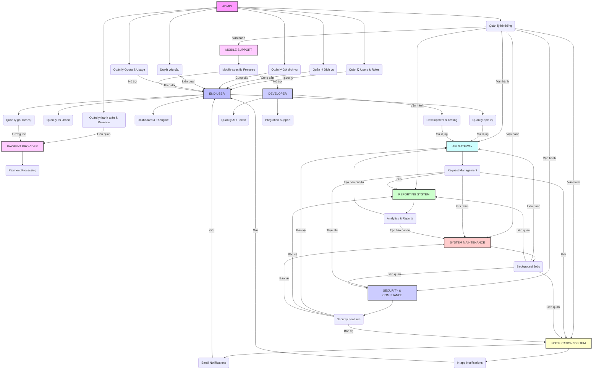

# Tài liệu UML Use Case Diagram

## Giới thiệu

Tài liệu này mô tả các trường hợp sử dụng (Use Case) của hệ thống SaaS quản lý dịch vụ, được phân loại theo các tác nhân (Actor) chính. Mỗi Use Case sẽ được trình bày chi tiết với mô tả, các luồng chính và luồng thay thế (nếu có), cùng với sơ đồ UML Use Case tương ứng.

## Các tác nhân chính

- **ADMIN (Quản trị viên)**: Người dùng có quyền quản lý toàn bộ hệ thống, bao gồm người dùng, dịch vụ, gói dịch vụ, thanh toán và cấu hình hệ thống.
- **END USER (Người dùng cuối)**: Người dùng thông thường sử dụng các dịch vụ được cung cấp bởi hệ thống.
- **DEVELOPER (Nhà phát triển)**: Một vai trò đặc biệt của End User, tập trung vào việc tích hợp và sử dụng API của hệ thống.
- **PAYMENT PROVIDER (Nhà cung cấp thanh toán)**: Hệ thống bên ngoài chịu trách nhiệm xử lý các giao dịch thanh toán (ví dụ: Stripe, Momo).
- **API GATEWAY**: Cổng API chịu trách nhiệm định tuyến, xác thực, kiểm soát truy cập và giám sát các yêu cầu API.
- **NOTIFICATION SYSTEM**: Hệ thống gửi thông báo qua email hoặc trong ứng dụng.
- **REPORTING SYSTEM**: Hệ thống tạo và quản lý các báo cáo phân tích.
- **SYSTEM MAINTENANCE**: Các tác vụ bảo trì hệ thống chạy nền.
- **SECURITY & COMPLIANCE**: Các tính năng liên quan đến bảo mật và tuân thủ.
- **MOBILE SUPPORT**: Các tính năng hỗ trợ thiết bị di động.

## Sơ đồ UML Use Case tổng quan



## Chi tiết Use Case theo tác nhân

### 🧑‍💼 ADMIN (Quản trị viên)

#### Quản lý Users & Roles

```mermaid
mermaid
    graph TD
        actor Admin
        subgraph 


        subgraph "Quản lý Users & Roles"
            UC01[Xem danh sách tất cả users]
            UC02[Tìm kiếm và lọc users]
            UC03[Xem chi tiết thông tin user]
            UC04[Khóa/mở khóa tài khoản user]
            UC05[Xóa tài khoản user]
            UC06[Reset mật khẩu cho user]
            UC07[Thay đổi thông tin user]
            UC08[Tạo và quản lý roles]
            UC09[Phân quyền roles cho users]
            UC10[Xem lịch sử hoạt động của user]
        end
        Admin --> UC01
        Admin --> UC02
        Admin --> UC03
        Admin --> UC04
        Admin --> UC05
        Admin --> UC06
        Admin --> UC07
        Admin --> UC08
        Admin --> UC09
        Admin --> UC10
```

#### Quản lý Dịch vụ

```mermaid
    graph TD
        actor Admin
        subgraph "Quản lý Dịch vụ"
            UC11[Xem danh sách tất cả dịch vụ]
            UC12[Thêm dịch vụ mới vào hệ thống]
            UC13[Cập nhật thông tin dịch vụ]
            UC14[Enable/Disable dịch vụ]
            UC15[Cấu hình API endpoint cho dịch vụ]
            UC16[Xem logs và performance của từng dịch vụ]
            UC17[Cấu hình rate limit cho từng dịch vụ]
            UC18[Quản lý version của dịch vụ]
        end
        Admin --> UC11
        Admin --> UC12
        Admin --> UC13
        Admin --> UC14
        Admin --> UC15
        Admin --> UC16
        Admin --> UC17
        Admin --> UC18
```

#### Quản lý Gói dịch vụ (Plans)

```mermaid
    graph TD
        actor Admin
        subgraph "Quản lý Gói dịch vụ (Plans)"
            UC19[Tạo gói dịch vụ mới]
            UC20[Cập nhật thông tin gói]
            UC21[Xóa hoặc ngừng bán gói dịch vụ]
            UC22[Cấu hình quota cho từng gói]
            UC23[Thiết lập giá và chu kỳ thanh toán]
            UC24[Xem thống kê người dùng theo gói]
        end
        Admin --> UC19
        Admin --> UC20
        Admin --> UC21
        Admin --> UC22
        Admin --> UC23
        Admin --> UC24
```

#### Duyệt yêu cầu

```mermaid
    graph TD
        actor Admin
        subgraph "Duyệt yêu cầu"
            UC25[Xem danh sách yêu cầu đăng ký chờ duyệt]
            UC26[Duyệt yêu cầu đăng ký]
            UC27[Xem chi tiết yêu cầu và lý do đăng ký]
            UC28[Gửi email thông báo kết quả duyệt]
            UC29[Duyệt yêu cầu nâng cấp gói dịch vụ]
            UC30[Duyệt yêu cầu tăng quota đặc biệt]
        end
        Admin --> UC25
        Admin --> UC26
        Admin --> UC27
        Admin --> UC28
        Admin --> UC29
        Admin --> UC30
```

#### Quản lý Quota & Usage

```mermaid
    graph TD
        actor Admin
        subgraph "Quản lý Quota & Usage"
            UC31[Xem tổng quan usage toàn hệ thống]
            UC32[Thiết lập quota mặc định cho từng gói]
            UC33[Điều chỉnh quota riêng cho user cụ thể]
            UC34[Theo dõi usage real-time]
            UC35[Cảnh báo khi usage gần đạt limit]
            UC36[Reset quota cho user]
            UC37[Xem báo cáo usage theo ngày/tuần/tháng]
            UC38[Export báo cáo usage]
        end
        Admin --> UC31
        Admin --> UC32
        Admin --> UC33
        Admin --> UC34
        Admin --> UC35
        Admin --> UC36
        Admin --> UC37
        Admin --> UC38
```

#### Quản lý hệ thống

```mermaid
    graph TD
        actor Admin
        subgraph "Quản lý hệ thống"
            UC39[Xem dashboard tổng quan hệ thống]
            UC40[Theo dõi health check các microservices]
            UC41[Xem system logs và error logs]
            UC42[Quản lý cấu hình hệ thống]
            UC43[Backup và restore dữ liệu]
            UC44[Quản lý maintenance mode]
        end
        Admin --> UC39
        Admin --> UC40
        Admin --> UC41
        Admin --> UC42
        Admin --> UC43
        Admin --> UC44
```

#### Quản lý thanh toán & Revenue

```mermaid
    graph TD
        actor Admin
        subgraph "Quản lý thanh toán & Revenue"
            UC45[Xem tổng quan doanh thu]
            UC46[Theo dõi các giao dịch thanh toán]
            UC47[Xử lý refund và dispute]
            UC48[Xem báo cáo tài chính]
            UC49[Cấu hình payment providers]
        end
        Admin --> UC45
        Admin --> UC46
        Admin --> UC47
        Admin --> UC48
        Admin --> UC49
```

### 👤 END USER (Người dùng cuối)

#### Quản lý tài khoản

```mermaid
    graph TD
        actor "End User"
        subgraph "Quản lý tài khoản"
            UC50[Đăng ký tài khoản mới]
            UC51[Xác thực email đăng ký]
            UC52[Đăng nhập bằng email/password]
            UC53[Đăng nhập bằng OAuth2]
            UC54[Quên mật khẩu và reset]
            UC55[Đổi mật khẩu]
            UC56[Cập nhật thông tin profile]
            UC57[Đổi avatar]
            UC58[Xóa tài khoản]
            UC59[Xem lịch sử đăng nhập]
        end
        "End User" --> UC50
        "End User" --> UC51
        "End User" --> UC52
        "End User" --> UC53
        "End User" --> UC54
        "End User" --> UC55
        "End User" --> UC56
        "End User" --> UC57
        "End User" --> UC58
        "End User" --> UC59
```

#### Quản lý gói dịch vụ

```mermaid
    graph TD
        actor "End User"
        subgraph "Quản lý gói dịch vụ"
            UC60[Xem danh sách các gói dịch vụ]
            UC61[So sánh tính năng các gói]
            UC62[Đăng ký gói Free]
            UC63[Nâng cấp lên gói Trial/Premium]
            UC64[Thanh toán gói dịch vụ]
            UC65[Xem lịch sử thanh toán]
            UC66[Hủy subscription]
            UC67[Gia hạn gói dịch vụ]
            UC68[Yêu cầu refund]
        end
        "End User" --> UC60
        "End User" --> UC61
        "End User" --> UC62
        "End User" --> UC63
        "End User" --> UC64
        "End User" --> UC65
        "End User" --> UC66
        "End User" --> UC67
        "End User" --> UC68
```

#### Dashboard & Thống kê

```mermaid
    graph TD
        actor "End User"
        subgraph "Dashboard & Thống kê"
            UC69[Xem dashboard tổng quan]
            UC70[Xem thống kê usage gần đây]
            UC71[Xem biểu đồ usage theo ngày/tuần/tháng]
            UC72[Xem quota còn lại]
            UC73[Xem tình trạng API keys]
            UC74[Nhận thông báo khi gần hết quota]
            UC75[Export dữ liệu usage]
        end
        "End User" --> UC69
        "End User" --> UC70
        "End User" --> UC71
        "End User" --> UC72
        "End User" --> UC73
        "End User" --> UC74
        "End User" --> UC75
```

#### Quản lý dịch vụ

```mermaid
    graph TD
        actor "End User"
        subgraph "Quản lý dịch vụ"
            UC76[Xem danh sách dịch vụ available]
            UC77[Đọc documentation cho từng dịch vụ]
            UC78[Test API trực tiếp trên web]
            UC79[Xem sample code integration]
            UC80[Enable/disable dịch vụ trong account]
            UC81[Xem pricing cho từng dịch vụ]
        end
        "End User" --> UC76
        "End User" --> UC77
        "End User" --> UC78
        "End User" --> UC79
        "End User" --> UC80
        "End User" --> UC81
```

### 💻 DEVELOPER (Vai trò của End User)

#### Quản lý API Token

```mermaid
    graph TD
        actor Developer
        subgraph "Quản lý API Token"
            UC82[Tạo API key mới]
            UC83[Xem danh sách API keys]
            UC84[Đặt tên và mô tả cho API key]
            UC85[Copy API key]
            UC86[Regenerate API key]
            UC87[Thu hồi/xóa API key]
            UC88[Cấu hình permissions cho API key]
            UC89[Xem usage cho từng API key]
            UC90[Thiết lập expiry date cho API key]
        end
        Developer --> UC82
        Developer --> UC83
        Developer --> UC84
        Developer --> UC85
        Developer --> UC86
        Developer --> UC87
        Developer --> UC88
        Developer --> UC89
        Developer --> UC90
```

#### Development & Testing

```mermaid
    graph TD
        actor Developer
        subgraph "Development & Testing"
            UC91[Test API endpoints]
            UC92[Xem API documentation]
            UC93[Download SDK/libraries]
            UC94[Xem code examples]
            UC95[Sử dụng API playground]
            UC96[Debug API calls]
            UC97[Xem API response logs]
            UC98[Monitor API performance]
            UC99[Nhận webhook notifications]
        end
        Developer --> UC91
        Developer --> UC92
        Developer --> UC93
        Developer --> UC94
        Developer --> UC95
        Developer --> UC96
        Developer --> UC97
        Developer --> UC98
        Developer --> UC99
```

#### Integration Support

```mermaid
    graph TD
        actor Developer
        subgraph "Integration Support"
            UC100[Tạo support ticket]
            UC101[Chat với support team]
            UC102[Xem knowledge base]
            UC103[Tham gia developer community]
            UC104[Đánh giá API quality]
            UC105[Báo cáo bugs/issues]
        end
        Developer --> UC100
        Developer --> UC101
        Developer --> UC102
        Developer --> UC103
        Developer --> UC104
        Developer --> UC105
```

### 💳 PAYMENT PROVIDER (Stripe, Momo, etc.)

#### Payment Processing

```mermaid
    graph TD
        actor "Payment Provider"
        subgraph "Payment Processing"
            UC106[Xử lý thanh toán subscription]
            UC107[Gửi webhook payment success]
            UC108[Gửi webhook payment failed]
            UC109[Xử lý recurring payments]
            UC110[Xử lý refund requests]
            UC111[Gửi invoice]
            UC112[Validate payment methods]
        end
        "Payment Provider" --> UC106
        "Payment Provider" --> UC107
        "Payment Provider" --> UC108
        "Payment Provider" --> UC109
        "Payment Provider" --> UC110
        "Payment Provider" --> UC111
        "Payment Provider" --> UC112
```

### 🚪 API GATEWAY

#### Request Management

```mermaid
    graph TD
        actor "API Gateway"
        subgraph "Request Management"
            UC113[Route request đến service tương ứng]
            UC114[Xác thực API key/token]
            UC115[Kiểm tra permissions]
            UC116[Apply rate limiting]
            UC117[Check quota limitations]
            UC118[Log all API calls]
            UC119[Collect usage metrics]
            UC120[Handle service failures]
            UC121[Load balancing]
            UC122[Cache responses]
            UC123[Transform request/response]
            UC124[Monitor API performance]
        end
        "API Gateway" --> UC113
        "API Gateway" --> UC114
        "API Gateway" --> UC115
        "API Gateway" --> UC116
        "API Gateway" --> UC117
        "API Gateway" --> UC118
        "API Gateway" --> UC119
        "API Gateway" --> UC120
        "API Gateway" --> UC121
        "API Gateway" --> UC122
        "API Gateway" --> UC123
        "API Gateway" --> UC124
```

### 🔔 NOTIFICATION SYSTEM

#### Email Notifications

```mermaid
    graph TD
        actor "Notification System"
        subgraph "Email Notifications"
            UC125[Gửi email xác thực đăng ký]
            UC126[Gửi email reset password]
            UC127[Gửi email thông báo quota warning]
            UC128[Gửi email payment confirmation]
            UC129[Gửi email quota exceeded]
            UC130[Gửi email service downtime]
            UC131[Gửi monthly usage report]
        end
        "Notification System" --> UC125
        "Notification System" --> UC126
        "Notification System" --> UC127
        "Notification System" --> UC128
        "Notification System" --> UC129
        "Notification System" --> UC130
        "Notification System" --> UC131
```

#### In-app Notifications

```mermaid
    graph TD
        actor "Notification System"
        subgraph "In-app Notifications"
            UC132[Hiển thị thông báo real-time]
            UC133[Đánh dấu đã đọc/chưa đọc]
            UC134[Xóa notifications]
            UC135[Cấu hình notification preferences]
        end
        "Notification System" --> UC132
        "Notification System" --> UC133
        "Notification System" --> UC134
        "Notification System" --> UC135
```

### 📊 REPORTING SYSTEM

#### Analytics & Reports

```mermaid
    graph TD
        actor "Reporting System"
        subgraph "Analytics & Reports"
            UC136[Tạo custom reports]
            UC137[Schedule automated reports]
            UC138[Export reports multiple formats]
            UC139[Share reports với team]
            UC140[Real-time analytics dashboard]
            UC141[Predictive usage analytics]
            UC142[Cost optimization recommendations]
        end
        "Reporting System" --> UC136
        "Reporting System" --> UC137
        "Reporting System" --> UC138
        "Reporting System" --> UC139
        "Reporting System" --> UC140
        "Reporting System" --> UC141
        "Reporting System" --> UC142
```

### 🛠️ SYSTEM MAINTENANCE

#### Background Jobs

```mermaid
    graph TD
        actor "System Maintenance"
        subgraph "Background Jobs"
            UC143[Cleanup expired tokens]
            UC144[Archive old logs]
            UC145[Update usage statistics]
            UC146[Send scheduled notifications]
            UC147[Health check services]
            UC148[Backup databases]
            UC149[Monitor system resources]
        end
        "System Maintenance" --> UC143
        "System Maintenance" --> UC144
        "System Maintenance" --> UC145
        "System Maintenance" --> UC146
        "System Maintenance" --> UC147
        "System Maintenance" --> UC148
        "System Maintenance" --> UC149
```

### 🔒 SECURITY & COMPLIANCE

#### Security Features

```mermaid
    graph TD
        actor "Security & Compliance"
        subgraph "Security Features"
            UC150[Enable 2FA authentication]
            UC151[Monitor suspicious activities]
            UC152[IP whitelisting]
            UC153[Audit trail logging]
            UC154[Data encryption]
            UC155[GDPR compliance features]
            UC156[Security scan reports]
        end
        "Security & Compliance" --> UC150
        "Security & Compliance" --> UC151
        "Security & Compliance" --> UC152
        "Security & Compliance" --> UC153
        "Security & Compliance" --> UC154
        "Security & Compliance" --> UC155
        "Security & Compliance" --> UC156
```

### 📱 MOBILE SUPPORT

#### Mobile-specific Features

```mermaid
    graph TD
        actor "Mobile Support"
        subgraph "Mobile-specific Features"
            UC157[Mobile-responsive dashboard]
            UC158[Mobile app notifications (future)]
            UC159[Mobile API testing tools]
            UC160[Quick actions for mobile]
        end
        "Mobile Support" --> UC157
        "Mobile Support" --> UC158
        "Mobile Support" --> UC159
        "Mobile Support" --> UC160
```


