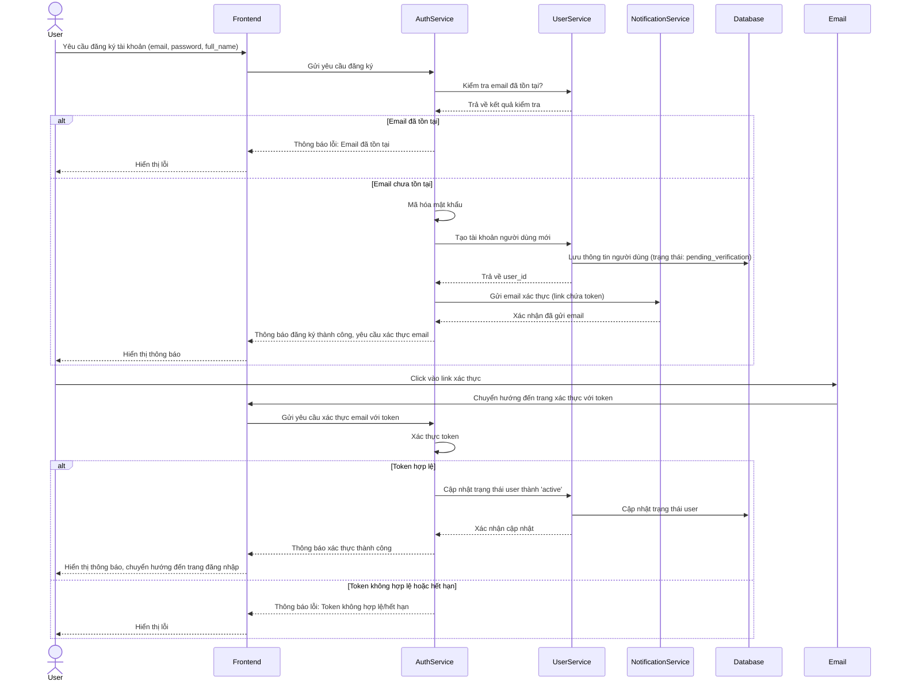
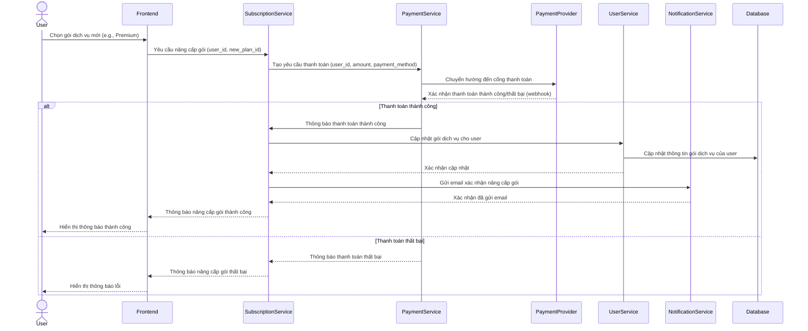
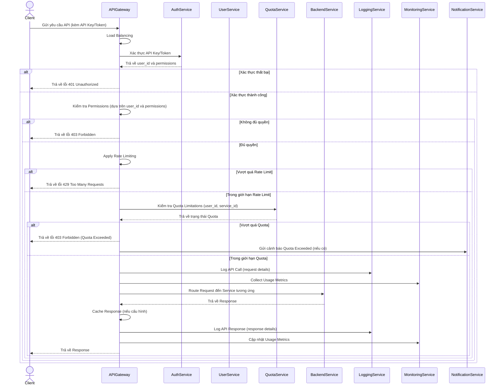
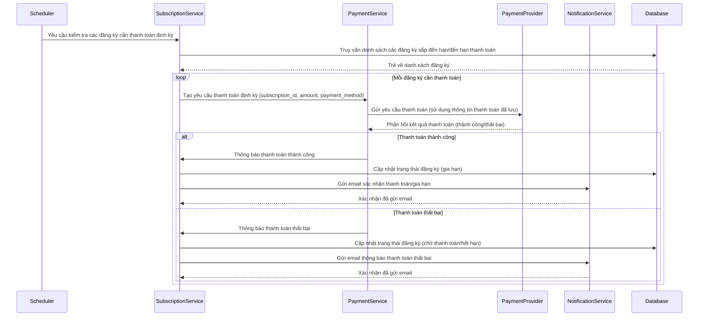

# Tài liệu mô tả luồng xử lý các Use Case phức tạp

## Giới thiệu

Tài liệu này tập trung mô tả chi tiết luồng xử lý của một số Use Case phức tạp trong hệ thống SaaS quản lý dịch vụ. Việc phân tích luồng xử lý giúp làm rõ các bước tương tác giữa người dùng và hệ thống, cũng như giữa các thành phần nội bộ của hệ thống, đặc biệt là trong môi trường microservice.

## 1. Luồng xử lý: Đăng ký tài khoản mới (UC50)

### Mô tả

Use Case này mô tả quá trình người dùng mới đăng ký tài khoản trên hệ thống. Quá trình này bao gồm việc nhập thông tin, xác thực email, và tạo tài khoản người dùng với các vai trò và gói dịch vụ mặc định.

### Sơ đồ luồng hoạt động

### Các bước chi tiết

1.  **Người dùng yêu cầu đăng ký**: Người dùng truy cập trang đăng ký và nhập các thông tin cần thiết như email, mật khẩu, họ tên. Frontend (ứng dụng web/mobile) thu thập thông tin này.
2.  **Gửi yêu cầu đăng ký đến AuthService**: Frontend gửi yêu cầu đăng ký đến `AuthService` (dịch vụ xác thực).
3.  **Kiểm tra email tồn tại**: `AuthService` gọi đến `UserService` (dịch vụ quản lý người dùng) để kiểm tra xem email đã được sử dụng để đăng ký trước đó hay chưa.
4.  **Phản hồi kiểm tra email**: `UserService` truy vấn cơ sở dữ liệu và trả về kết quả cho `AuthService`.
    *   **Nếu email đã tồn tại**: `AuthService` trả về lỗi cho Frontend, và Frontend hiển thị thông báo lỗi cho người dùng.
    *   **Nếu email chưa tồn tại**: 
        *   `AuthService` mã hóa mật khẩu của người dùng.
        *   `AuthService` gọi `UserService` để tạo một bản ghi người dùng mới trong cơ sở dữ liệu với trạng thái ban đầu là `pending_verification`.
        *   `UserService` lưu thông tin vào `Database` và trả về `user_id` cho `AuthService`.
        *   `AuthService` gửi yêu cầu đến `NotificationService` (dịch vụ thông báo) để gửi một email xác thực đến địa chỉ email của người dùng. Email này chứa một liên kết duy nhất với một token xác thực.
        *   `NotificationService` xác nhận đã gửi email.
        *   `AuthService` trả về thông báo đăng ký thành công cho Frontend, yêu cầu người dùng kiểm tra email để xác thực.
        *   Frontend hiển thị thông báo này cho người dùng.
5.  **Người dùng xác thực email**: Người dùng nhận được email và nhấp vào liên kết xác thực. Liên kết này sẽ chuyển hướng người dùng trở lại Frontend với token xác thực.
6.  **Gửi yêu cầu xác thực đến AuthService**: Frontend gửi yêu cầu xác thực email cùng với token đến `AuthService`.
7.  **Xác thực token**: `AuthService` kiểm tra tính hợp lệ và thời hạn của token.
    *   **Nếu token hợp lệ**: `AuthService` gọi `UserService` để cập nhật trạng thái của người dùng từ `pending_verification` thành `active` trong cơ sở dữ liệu.
        *   `UserService` cập nhật `Database` và xác nhận lại cho `AuthService`.
        *   `AuthService` trả về thông báo xác thực thành công cho Frontend.
        *   Frontend hiển thị thông báo và chuyển hướng người dùng đến trang đăng nhập.
    *   **Nếu token không hợp lệ hoặc hết hạn**: `AuthService` trả về lỗi cho Frontend, và Frontend hiển thị lỗi cho người dùng.

## 2. Luồng xử lý: Nâng cấp gói dịch vụ (UC63)

### Mô tả

Use Case này mô tả quá trình người dùng hiện tại nâng cấp gói dịch vụ của họ lên một gói cao hơn (ví dụ: từ Free lên Trial/Premium). Quá trình này bao gồm việc lựa chọn gói, thanh toán, và cập nhật trạng thái gói dịch vụ của người dùng.

### Sơ đồ luồng hoạt động

### Các bước chi tiết

1.  **Người dùng chọn gói dịch vụ mới**: Người dùng truy cập trang quản lý gói dịch vụ, xem danh sách các gói và chọn gói muốn nâng cấp (ví dụ: gói Premium).
2.  **Gửi yêu cầu nâng cấp gói**: Frontend gửi yêu cầu nâng cấp gói đến `SubscriptionService` (dịch vụ quản lý đăng ký), bao gồm `user_id` và `new_plan_id`.
3.  **Tạo yêu cầu thanh toán**: `SubscriptionService` tính toán số tiền cần thanh toán và gửi yêu cầu tạo giao dịch thanh toán đến `PaymentService` (dịch vụ thanh toán).
4.  **Chuyển hướng đến cổng thanh toán**: `PaymentService` tương tác với `PaymentProvider` (nhà cung cấp thanh toán như Stripe, Momo) để khởi tạo giao dịch. Người dùng có thể được chuyển hướng đến trang thanh toán của `PaymentProvider`.
5.  **Xác nhận thanh toán**: Sau khi người dùng hoàn tất thanh toán, `PaymentProvider` gửi một webhook (hoặc callback) về cho `PaymentService` để thông báo kết quả giao dịch (thành công hoặc thất bại).
    *   **Nếu thanh toán thành công**: 
        *   `PaymentService` thông báo kết quả thành công cho `SubscriptionService`.
        *   `SubscriptionService` gọi `UserService` để cập nhật thông tin gói dịch vụ của người dùng trong cơ sở dữ liệu.
        *   `UserService` cập nhật `Database` và xác nhận lại cho `SubscriptionService`.
        *   `SubscriptionService` gửi yêu cầu đến `NotificationService` để gửi email xác nhận nâng cấp gói thành công cho người dùng.
        *   `NotificationService` xác nhận đã gửi email.
        *   `SubscriptionService` trả về thông báo nâng cấp gói thành công cho Frontend.
        *   Frontend hiển thị thông báo thành công cho người dùng.
    *   **Nếu thanh toán thất bại**: 
        *   `PaymentService` thông báo kết quả thất bại cho `SubscriptionService`.
        *   `SubscriptionService` trả về thông báo nâng cấp gói thất bại cho Frontend.
        *   Frontend hiển thị thông báo lỗi cho người dùng.

## 3. Luồng xử lý: Quản lý yêu cầu API qua API Gateway (UC113-UC124)

### Mô tả

Use Case này mô tả luồng xử lý một yêu cầu API từ khi nó đến API Gateway cho đến khi được xử lý bởi dịch vụ backend tương ứng và trả về phản hồi cho người dùng. Đây là một luồng phức tạp liên quan đến xác thực, kiểm tra quyền, giới hạn tốc độ, kiểm tra hạn ngạch, ghi log và định tuyến.

### Sơ đồ luồng hoạt động

### Các bước chi tiết

1.  **Client gửi yêu cầu API**: Người dùng hoặc ứng dụng client gửi một yêu cầu HTTP đến API Gateway, kèm theo API Key hoặc Token trong header hoặc query parameter.
2.  **Load Balancing**: API Gateway (hoặc một thành phần phía trước nó) thực hiện cân bằng tải để định tuyến yêu cầu đến một instance API Gateway khả dụng.
3.  **Xác thực API Key/Token**: API Gateway gửi API Key/Token đến `AuthService` (dịch vụ xác thực) để kiểm tra tính hợp lệ. `AuthService` sẽ xác thực và trả về `user_id` cùng với các quyền (`permissions`) liên quan đến API Key/Token đó.
    *   **Nếu xác thực thất bại**: API Gateway trả về lỗi `401 Unauthorized` cho Client.
4.  **Kiểm tra Permissions**: Nếu xác thực thành công, API Gateway kiểm tra xem `user_id` có đủ quyền để truy cập vào tài nguyên hoặc thực hiện hành động được yêu cầu hay không, dựa trên `permissions` nhận được từ `AuthService`.
    *   **Nếu không đủ quyền**: API Gateway trả về lỗi `403 Forbidden` cho Client.
5.  **Apply Rate Limiting**: Nếu đủ quyền, API Gateway áp dụng giới hạn tốc độ (rate limiting) để ngăn chặn việc lạm dụng API. Điều này có thể dựa trên IP, API Key, hoặc `user_id`.
    *   **Nếu vượt quá Rate Limit**: API Gateway trả về lỗi `429 Too Many Requests` cho Client.
6.  **Kiểm tra Quota Limitations**: Nếu trong giới hạn rate limit, API Gateway gửi yêu cầu đến `QuotaService` (dịch vụ quản lý hạn ngạch) để kiểm tra xem `user_id` có còn hạn ngạch sử dụng cho dịch vụ được yêu cầu hay không.
    *   **Nếu vượt quá Quota**: API Gateway trả về lỗi `403 Forbidden` (với thông báo Quota Exceeded) cho Client. Đồng thời, API Gateway có thể gửi cảnh báo đến `NotificationService` để thông báo cho người dùng về việc hết hạn ngạch.
7.  **Log API Call & Collect Usage Metrics**: Nếu trong giới hạn quota, API Gateway ghi lại chi tiết yêu cầu API vào `LoggingService` và gửi các chỉ số sử dụng đến `MonitoringService`.
8.  **Route Request đến Backend Service**: API Gateway định tuyến yêu cầu đến dịch vụ backend tương ứng (ví dụ: `UserService`, `SubscriptionService`, hoặc các dịch vụ cụ thể như `STTService`, `OCRService`).
9.  **Backend Service xử lý và trả về Response**: Dịch vụ backend xử lý yêu cầu và gửi phản hồi trở lại API Gateway.
10. **Cache Responses (tùy chọn)**: Nếu được cấu hình, API Gateway có thể lưu trữ phản hồi vào bộ nhớ cache để phục vụ các yêu cầu tương tự trong tương lai nhanh hơn.
11. **Log API Response & Cập nhật Usage Metrics**: API Gateway ghi lại chi tiết phản hồi vào `LoggingService` và cập nhật các chỉ số sử dụng trong `MonitoringService`.
12. **Trả về Response cho Client**: Cuối cùng, API Gateway trả về phản hồi cho Client.

## 4. Luồng xử lý: Xử lý thanh toán định kỳ (UC109)

### Mô tả

Use Case này mô tả luồng xử lý thanh toán định kỳ (recurring payments) cho các gói dịch vụ đã đăng ký. Đây là một quá trình tự động diễn ra theo chu kỳ thanh toán của người dùng, liên quan đến việc kiểm tra trạng thái đăng ký, gửi yêu cầu thanh toán đến nhà cung cấp thanh toán, và cập nhật trạng thái thanh toán trong hệ thống.

### Sơ đồ luồng hoạt động

### Các bước chi tiết

1.  **Scheduler kích hoạt**: Một tác vụ định kỳ (`Scheduler`) được cấu hình để chạy hàng ngày (hoặc theo chu kỳ phù hợp) và gửi yêu cầu đến `SubscriptionService` để kiểm tra các đăng ký cần thanh toán định kỳ.
2.  **Truy vấn danh sách đăng ký**: `SubscriptionService` truy vấn cơ sở dữ liệu để lấy danh sách các đăng ký mà thời gian thanh toán định kỳ của chúng sắp đến hạn hoặc đã đến hạn.
3.  **Xử lý từng đăng ký**: Đối với mỗi đăng ký trong danh sách:
    *   `SubscriptionService` tạo một yêu cầu thanh toán định kỳ và gửi đến `PaymentService`, bao gồm `subscription_id`, số tiền cần thanh toán và phương thức thanh toán đã lưu của người dùng.
    *   `PaymentService` gửi yêu cầu thanh toán này đến `PaymentProvider` (ví dụ: Stripe, Momo) sử dụng thông tin thanh toán đã được lưu trữ (ví dụ: thẻ tín dụng đã được token hóa).
    *   `PaymentProvider` xử lý giao dịch và gửi phản hồi về cho `PaymentService` (thành công hoặc thất bại).
    *   **Nếu thanh toán thành công**: 
        *   `PaymentService` thông báo kết quả thành công cho `SubscriptionService`.
        *   `SubscriptionService` cập nhật trạng thái của đăng ký trong cơ sở dữ liệu (ví dụ: gia hạn `end_date`).
        *   `SubscriptionService` gửi yêu cầu đến `NotificationService` để gửi email xác nhận thanh toán và gia hạn gói dịch vụ cho người dùng.
        *   `NotificationService` xác nhận đã gửi email.
    *   **Nếu thanh toán thất bại**: 
        *   `PaymentService` thông báo kết quả thất bại cho `SubscriptionService`.
        *   `SubscriptionService` cập nhật trạng thái của đăng ký trong cơ sở dữ liệu (ví dụ: chuyển sang trạng thái `pending_payment` hoặc `expired` tùy theo chính sách).
        *   `SubscriptionService` gửi yêu cầu đến `NotificationService` để gửi email thông báo thanh toán thất bại cho người dùng, có thể kèm theo hướng dẫn để cập nhật phương thức thanh toán hoặc thử lại.
        *   `NotificationService` xác nhận đã gửi email.

